# The Honesty Bakery

The Honesty Bakery is a local cake store in my town. I built this full-stack website for them, using React, Redux, Tailwind, Django, PostgresSQL, and some Vanilla JS. The branding and tone is consistent, and it caters to all audiences who pass the physical shop or website. There are limited pages, but it offers an intuitive layout. 

--- 

## Table of Contents

- [User Experience (UX)](#user-experience-ux)
  - [Strategy Plane](#strategy-plane)
  - [Scope Plane](#scope-plane)
  - [Structure Plane](#structure-plane)
  - [Skeleton Plane](#skeleton-plane)
  - [Surface Plane](#surface-plane)
- [Wireframes](#wireframes)
- [Features](#features)
- [Technologies Used](#technologies-used)
- [Setting Up Stripe Payments](#setting-up-stripe-payments)
- [Merging Django With React](#merging-django--react)
- [Deployment](#deployment)
- [Testing](#testing)
  - [User Stories Testing](#user-stories-testing)
  - [Manual Testing](#manual-testing)
  - [Validators and Tools](#validators-and-tools)
  - [Bugs](#bugs)
- [Credits](#credits)
- [Acknowledgements](#acknowledgements)

---

## User Experience (UX)

### Strategy Plane

1. Developer Goals

My overall goal was to develop an intuitive website for a local business that adhered to brand tone. To acheive this, I created these suer stories for myself:

- As the developer, I want to use React.JS to create components and screens for the website. 
- As a developer, I want to use PostgresSQL to manage the business database. 
- As a developer, I want to demonstrate my ability to write clean code to showcase my skills. 

2. Business Goals

The small business I created this for had general and specific goals:

- As the business owner, I want to easily navigate my website as a customer would.
- As the business owner, I want to easily create new products for display.
- As the business owner, I want to easily sign in and out. 
- As the business owner, I want a secure and efficient checkout process. 
- As the business owner, I want the branding and messaging to be consistent. 

3. Customer Goals

- As a customer, I want to know what the business offers on page 1. 
- As a customer, I want clear call-to-actions on relevant pages. 
- As a customers, I want to easily contact the owner. 
- As a customer, I want intuitive navigation and checkout. 
- As a customer, I want to easily find the social media links.
- As a customer, I want to be able to leave feedback.  

### Scope Plane

**Core Features**

- CTA's on home page. 
- Product screens for types of product. 
- Individual product screens. 
- Add to cart.
- Adjust the quantity.
- Contact business. 
- Register + Login
- Stripe Payments.

**Enhancements**

- Product Reviews. 
- Visual Hover Effects.
- Order History.
- 

**Possible Extra's**

- Search Feature
- **INCLUDE MORE HERE**

**Features not Included & Why?**

- Wishlist - User's can already purchase without saving.
- Extra Floating Graphics (Bee's) - Too cluttered and not worth the extra coding. 
- Order Tracking - There won't be future delivery.
- Advanced product filtering - There is only a small product catalogue. 

### Structure Plane

**Information architecture**

The information architecture of the site is designed to be simple and intuitive. Products are organised into clear categories based on their type, allowing users to quickly locate items. Each product follows a consistent layout, presenting essential information such as pricing, availability, and description in a predictable order. User account features and administrative tools are separated from the main browsing experience to reduce cognitive load and maintain clarity.

Products are grouped by type:
- Ready-to-Bake Cakes
- Pre-baked Cakes

Each product follows a consistent structure:
- Image
- Name
- Price
- Description
- Stock status

User-related content is separated:
- Login / Register
- Cart
- Checkout
- Order history
- Admin functionality is isolated:
- Product management
- Order management

**Navigation model**

The navigation model prioritises ease of movement and minimal friction. A persistent navigation bar allows users to access core pages from anywhere on the site. Product images and titles link directly to individual product pages, supporting intuitive exploration. Contextual navigation, such as the “Go Back” button on product pages, enables users to return to previous listings without disrupting their browsing flow. Clear call-to-action buttons guide users through the purchasing journey from browsing to checkout.

- Top navigation bar (Home, About, Contact, Cakes)
- Dropdown for cake categories
- Clickable product cards
- “Go Back” navigation on product pages
- Cart icon visible at all times
- Button-based calls to action (Add to Order, Checkout)

### Skeleton Plane

**Wireframes**

The website was designed on Fignma. 

1. Home Page:

- Wireframes for mobile, tablet, desktop
- Priority/content layout decisions

### Surface Plane
- Final design decisions (color palette, fonts, visual elements)

---

## Wireframes

1. Home Page - Desktop:

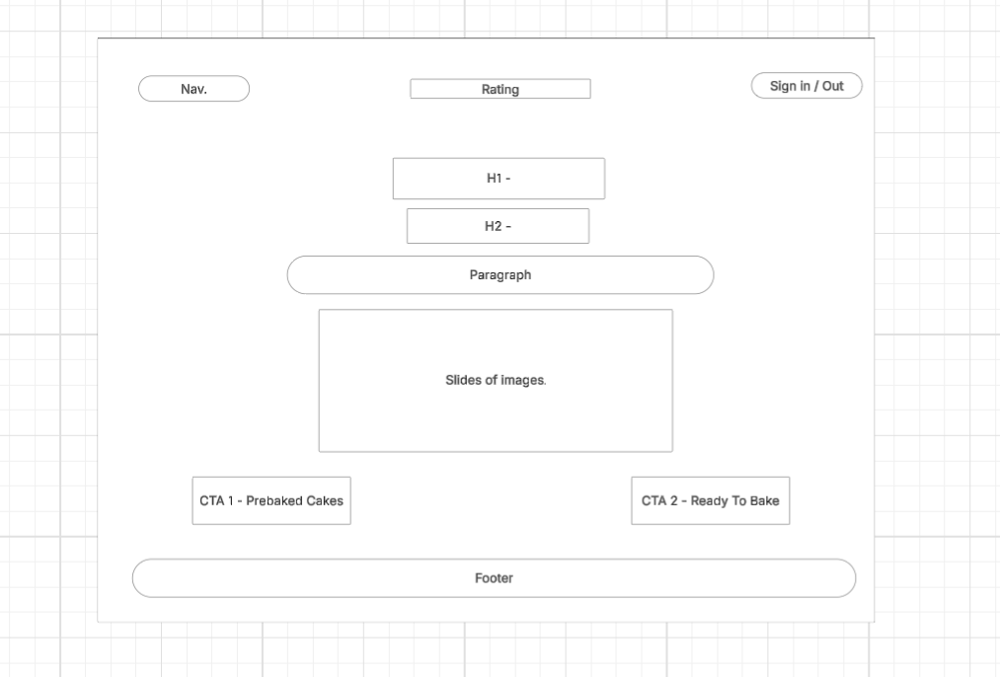

2. About Page - Desktop:

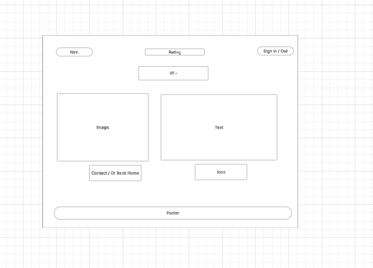

3. Contact Page - Desktop:

**PROVIDE MOBILE/TABLET**

### ERD

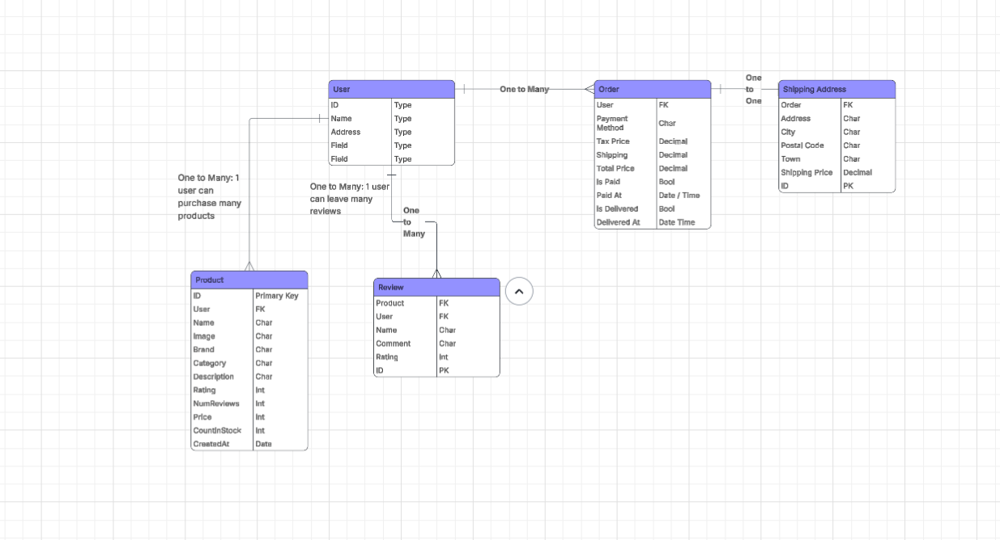

---

## Features

List and explain key features implemented in the project.

---

## Technologies Used

- HTML5
- CSS3
- JavaScript
- Stripe
- React.js
- Tailwind
- Django
- PostresSQL
- LucidChart (ERD's + Wireframes)
- [Any frameworks/libraries]
- [Design/UX tools used like Balsamiq]

---

## Setting Up Stripe Payments

To obtain the stripe API keys in order to communicate with the eCommerce store, you need to log into stripe, or create an account. From there, ensure to check the 'Test Mode' icon, to turn it on. 

Then, you should clearly see a section on that current screen titled 'For developers' which will have the PK_test key and the SK_test key, ready to copy. 

NOTE: Never paste these keys into your settings, views, or anywhere that - when pushing - exposes them to github. 

Your keys must be in your env.py file, and that env.py file must be properly stated in the .gitignore file. 

Then, in your urls.py, you need import TemplateView: 

from django.views.generic import TemplateView

From there, you need to add a route which points to the index.html file in the build folder you created when you run 'npm run build'. 

The route is: path('', TemplateView.as_view(template_name='index.html')) - put this in the url patterns.

This index.html file is now where the react app lives, and it will update everytime you run 'npm run build' after every new change you make. 

Finally, in your STATICFILES_DIRS, within settings, you need to let it know that you also have static files in your frontend/build that you created. 

So, add this line:

BASE_DIR / 'frontend/build/static'

---

## Merging Django & React

To do this, ensure everything is saved, pushed, and all servers are closed, and terminals are shut. 

Then, open your folders, and move the frontend (react) into the backend (Django).

Then, open a terminal and change directory to the frontend: "cd backend" + "cd frontend" - takes you to the new location of your frontend folder. 

In here, type "npm run build"

"Run build" is something you would need to continue to run everytime you make changes to the website. 

From there, you will need to add the following "os.path..." to your 'DIRS' in the Templates section of settings:

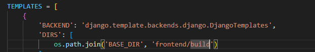

---

## Deployment

Explain how your project is deployed and how someone can clone and run it locally. Expand on this:
1. Clone this repository
2. Open in VS Code
3. Install dependencies
4. Run application

Link to live site: [Deployed Site](#)

---

## Testing

### User Stories Testing

List your user stories and describe how each was met in the final project.

### Manual Testing

- Navigation
- Responsiveness
- Browser compatibility
- Forms and interactivity

1. One of the first manual tests carried out was to click on one of the products displayed on the homescreen to see if the productScreen.js renders properly. For this to be successful, it needs to take you to a new page (not open a new one), show the 3 collumns (image, price, and details). 

I first Clicked on the 'Birthday Cake':

As you can see, it rendered successfully (excluding image fail).

2. The second manual test was to see if the if-statement properly checked if the product items are in stock. You can see the code below:

After saving and refreshing the live server (npm start - since it's react), the product screen showed 'Ready to Bake!' since I had set the stock to be greater than zero. 

Status:

Product.js showing stock as 1:

#### Checkout Testing

1. 'Add to Cart' button:

Clicking the 'Add to Cart' button took me straight to the cart page, displaying the total in the basket and total amount.

Cart page:

This all worked fine, however, I decided this wasn't best for the user experience. My plans moving forward were to create a notification that pops up for 5 seconds, showing that the item is added to the cart, but they stay on the same screen (unless the user clicks on the cart icon to go to the cart screen). 

This would make for a better experience, because the user wouldn't then have to keep clicking out of the cart screen if they wish to purcahse more products.

#### Login Testing

I attempted to log in after successfully registering a user (**include this above**), and I was met with an error 400 response. 

I checked the 'Network' tab in dev tools and tried to log in again, and found the error 400 in userActions:

Solution:

Change user_name = 'email' in views.py. After that, it worked:

**NEED TO CHANGE THE LOG IN DISPLAY - CHANGE FROM DISPLAYING THEIR EMAIL, TO 'LOG OUT'**

#### Login to Checkout Testing

1. I first successfully logged in:

2. I then added the single item to my basket:

3. I then clicked on checkout:

**NOW, ENSURE PAYMENT DETAILS ARE TAKEN BEFORE ORDER PLACED**

### Python Testing

All Python code in this project follows the PEP 8 style guide. The use of PEP8 allowed me to keep my Python code consistent and readable. To add PEP8, you need ensure you are operating within your virtual environment:

To add PEP8 to your project, it's essential you are operating within a virtual environment. 

1. Navigate to the Command Palette (Ctrl+Shift+P / Cmd+shift+p)

2. In the top navigation bar, you will now be able to find 'Venv'. Select it. 

3. From there, you will need to select your desired interpreter. I chose to use 3.12.8, which is needed for this project. 

4. After selecting the desired interpreter or Python version, a notification will show the progress of the environment creation and the environment folder will appear in your workspace.

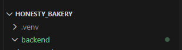

5. When operating within your virtual environment, you will see this at the far left of your terminal:

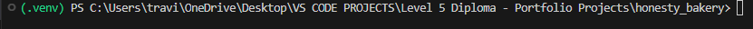

If you do not see that, you will need to be within the project root/or where your .venv folder lies, and type this into the terminal:

- ".venv/Scripts/Activate"

You should then see the green (.venv) appear at the beginning of the commond prompt line. 

6. Once you are within your virtual environment, then you can add PEP8 by searching for it in the extensions or via the terminal:

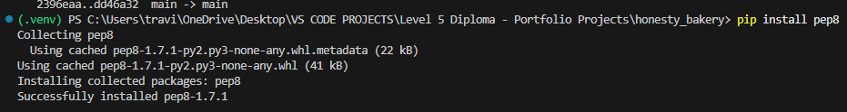

#### Testing with PEP8

PEP8 is the official Python style guide. To test that the project follows PEP8 standards, the `pycodestyle` tool was used.

##### Installing pycodestyle

In the terminal, install pycodestyle:

pip install pycodestyle

##### Running PEP8 tests

Individual files can be tested using:

pycodestyle path/to/file.py

For example:

pycodestyle base/views.py

The following files were tested and passed without errors:

- base/views.py

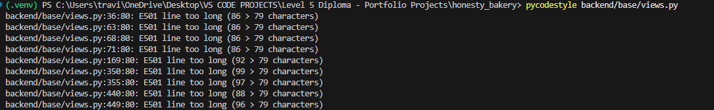

This result shows that my lines of code were simply longer than recommended, but no errors were present.

- base/models.py

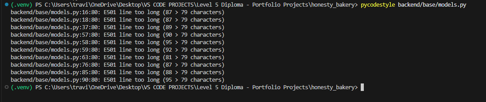

- base/urls.py

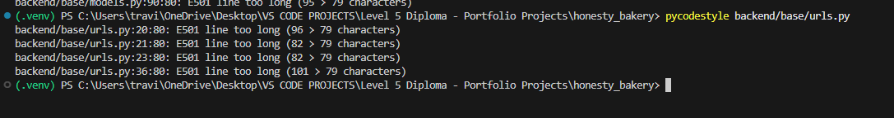

- base/serializers.py

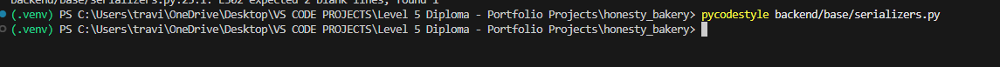

- base/products.py

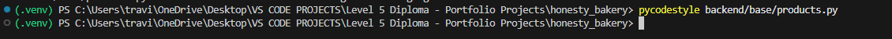

- base/apps.py

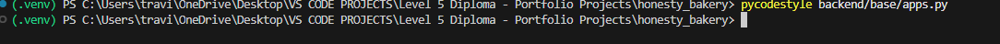

- backend/backend/urls.py

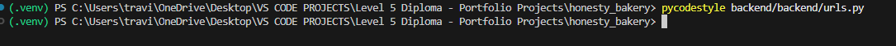

### Jest Tests

1. Hompage Headers

First, I ran simple Jest tests to seeif ym React and Javascript was written well, even though the code already renders the result I want. 

I used mock.jest in a separate test file to mock the DOM and react-redux environment. 

Here, you can see the reason for failure of the first test:

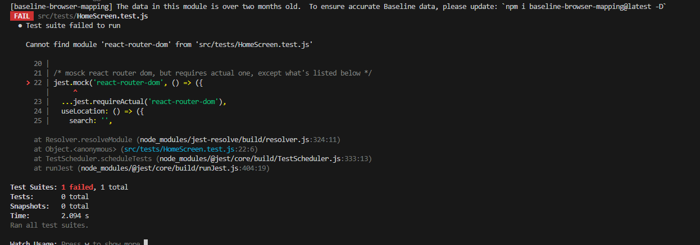

It says react-router-dom is not found, even though it is installed correctly. 

One of the reasons this test didn't run properly, was because I realised I needed to define my mocks before I import the homescreen. 

Secondly, I had to remove the "import test from "node:test";" from the top as it it not Jest. I deleted it and relid on Jests built-in function (test...).

After that, I had to ensure the Mocks were created first before the imports. This is because if HomeScreen loads before my imports, it will have tried to load Axios and crashed. 

After making those changes, the first test passed:

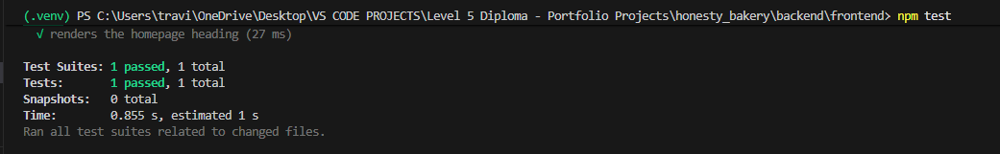

2. <Loading > component renders

This test is built to see if my Loading component renders when Redux says "Loading: true".

For this, I simply changed the initial mock section in homeScreen.test.js from 'loading: false' to true.

Then, I added a new test below the first one. 

First fail:

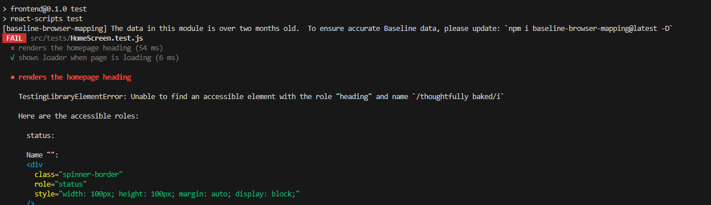

To ge this to pass, I had to create two separate returns for the 'useSelector'.

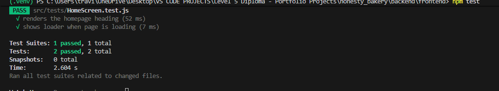

### Django Tests

The first thing you should do when writing multiple tests is create a test file.

Since my app name is called 'base', I put the folder in there. 

1. URL Test

For the first test, it was to see if my 'routes' url exists and confirms it loads correctly. 

Then, where my manage.py lives, I ran: python manage.py test.

This was the result on the first test:

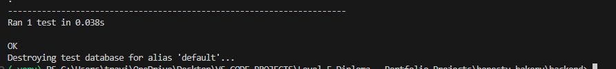

2. Testing Product List endpoint Returns 200

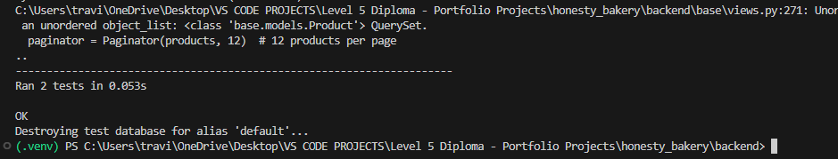

### Validators and Tools

- HTML Validator
- CSS Validator
- Lighthouse Report (Accessibility, SEO, etc.)

### Bugs

- Describe bugs encountered
- How you fixed them

---

## Credits

- [Links to any external code, images, or media]
- Clearly cite all third-party assets

---

## Acknowledgements

Mention any tutorials, mentors, or support resources used.

---

*********

## Testing 

This section documents full-scope testing, from beginning to end of production, using manual and automated tests. 

### Automated Testing

#### Jest

#### Python Tests

## Using Redux

I chose to use Redux in this app, firstly to learn how it's used, but also because I would end up having many pages that would require a global state. This global state is share in the Redux store and passed down to other pages. 

Having learned the importance of Redux in front end when it comes to building larger apps, I am glad I have included it. I will continue to learn more about it in my future project, but here are some examples of how to install and use Redux:

### Installing Redux

...

### Using Redux

## Installing + Using Stripe

In your terminal - in the backend - type: pip install stripe (for windows).

And for the frontend: npm i @stripe/stripe-js @stripe/react-stripe-js (assuming you used React, like me)

Then, follow these steps:

1. Add stripe secret key settings:

import os
# ...existing...

STRIPE_SECRET_KEY = os.environ.get("STRIPE_SECRET_KEY", "")
STRIPE_PUBLISHABLE_KEY = os.environ.get("STRIPE_PUBLISHABLE_KEY", "")

## Installing Font Awesome

When building a site with React, the simplest way to install and use Font Awesome is to install it using the terminal. 

1. From the root, type 'npm install @fontawesome/fontawesome-free'.
2. Then, to use icons, you simply start by creating an icon (<i></i>) section. 
3. Within the opening tag, you type in the 'className' of the icon you want to display. Or, you can somply copy the html from the font awesome website.

Example: These 'i' tags were copied from the free icons section in Font Awesome.

### Bugs

#### Frontend Bugs

1. Product Display Bug

The above image shows a classic bug caused by using Javascript Style comments within a JSX sextion. To remove this problem, I simply put curly braces around the Javascript style comments within thye JSX section, and it was resolved. 

Here it is fixed:

2. Product Screen (First bug)

The error is clear - 'Product' is not recognised. So, to solve this, I did some searching and found that the error was simple: misspelled 'product' as 'Product'. 

So I changed it to as lower-case p, and it worked:

3. Go Back Button

This above image shows a blank screen, but there should be a 'Go Back' button listed, as that is what I had coded to be returned on this page. I learned that this was due to the spelling of a className used in the link: 'btn-Light' should be 'btn-light'. 

Solved:

4. 500 Error

This bug was the result of my images not displaying on the home screen. 

The solution to this was found by the errors notes in the console:

This was solved by changing the 's' in 'spinner' to uppercase within my "Loading" component. 

Solved:

5. Adding To Cart

I learned that in V6, there is no 'history.push' function. So I had to rewrite my code. Google AI informed me that 'navigate' is used as a replacement.

Once that was replaced, it worked, and I continued with the manual test of adding to cart. 

#### Backend Bugs

1. Axios Bug

After some research, I learned that this bug means that my request never reached my Django API. 

--- 

### Setting Up Virtual Environment

Before you begin any work on the backend, it's best to set up your virutal environment. To do this, type the command "pip install virtualenv" into your terminal. Once installed, you are ready to activate the virtual environment. 

The screenshot below shows how this is done in the terminal:

Then, once activated, you will see ".venv" at the far left of your terminal:

Following that, you'll want to install django with "pip install django", and this will install the latest version:

### Creating Django Project

Once installed, you will then want to create the backend project using "django-admin startproject (projectname)"

I called mine 'Backend', so you can see it successfuly created below ".venv" in this screenshot:

### Creating Individual Apps

Once Django is ready, it's time to start creating backend apps. Before you do this, you will need to change into the project directory. For me, this command is "cd backend" from the root directory. 

Then, you will need to type the command "python manage.py startapp (appname)":

### Writing Your First View

When it comes to ensuring the backend project is connected to your backend app, you need to test that using a basic view and url pattern. I did this by first writing a view called getRoutes and returning 'Hello World.' 

Once that view is written, I then created a urls.py folder in the only app I have ('base'), and then importing that view I just created. 

I created the url pattern which states that when hitting the homescreen (''), I render the view getRoutes, and I gave it the name "get-routes". 

However, this wouldn't work just yet; I needed to connect the urls I created in the app to the main urls.py file in the backend project (called 'backend').

To do this, first add 'include' to the list of imports from django.urls. 

Then, add a new path to the urlpatterns. This will be as shown in the below screenshot:

### Using Django Rest Framework

The reason I decided to do this was because the Django Rest Framework will make my api's more powerfull. 

To install it, type this into your terminal: "pip install djangorestframework".

Once that is successfull, add 'rest_framework' to your installed apps section in settings.py. 

From there, you will need to head over to https://www.django-rest-framework.org/, and click on views, under the 'api' section:

Then, on the right hand side of the screen, click on 'api_view' and copy the highlighted text below to then paste into the views.py in your app:

Once you've added that, you will also need to import 'Response'.

## Amending Backend Data

To amend your backend data, you will first need to be able to log into the Django admin panel. To do this, start by creating a super user. 

1. In your terminal, ensure you are in the directory that holds manage.py. For me, it is the backend directory. 
2. Create your super user with "python manage.py createsuperuser", and then follow the instructions to set a user name, email and password.
3. Run the server: "python manage.py runserver".
4. From here, append the url with "/admin/" and you will be redirected to the Django Admin login dashboard. Enter your super user name and password to log in. 

This was my view onced logged in:

### Making New Databases

When you log into the backend, you shouldn't see any databases there yet. The first thing that needs to be done, is to create a data model in models.py, within the app. 

The first one I created was the product model.

Once it was fully coded, I ran migrations, then registered the new model in admin.py, which then sends the model to the django server.

To run migrations, simply: "python manage.py makemigrations"

At this point, you have a chance to see if the migrations are correct before fully migrating. If so: "python manage.py migrate"

Here, you can see the first model created in the Django Admin: Products

## Authentication

### JSON Web Tokens

These are just encoded data about a user. 

## Tech. Used

1. HTML5
2. CSS3
3. ReactBoostrap, found (https://react-bootstrap.netlify.app/)[here].
4. Bootswatch.
5. React.js
6. JavaScript
7. Django
8. Django Rest Framework
9. LucidChart

10. Redux
