# The Honesty Bakery

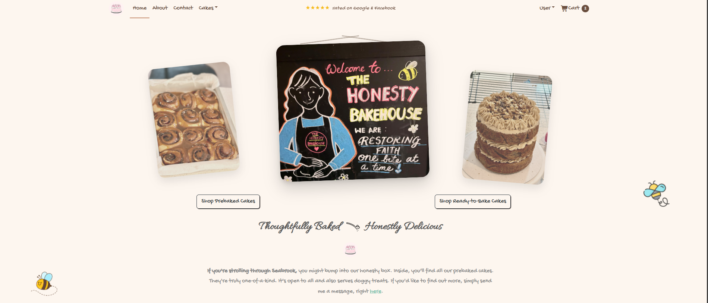

The Honesty Bakery is a local cake store in my town. I built this full-stack website for them, using React, Redux, Tailwind, Django, PostgresSQL, and some Vanilla JS. The branding and tone is consistent, and it caters to all audiences who pass the physical shop or website. There are limited pages, but it offers an intuitive layout. 

--- 

## Table of Contents

- [User Experience (UX)](#user-experience-ux)
  - [Strategy Plane](#strategy-plane)
  - [Scope Plane](#scope-plane)
  - [Structure Plane](#structure-plane)
  - [Skeleton Plane](#skeleton-plane)
  - [Surface Plane](#surface-plane)
- [Features](#features)
- [Technologies Used](#technologies-used)
- [Setting Up Stripe Payments](#setting-up-stripe-payments)
- [Merging Django With React](#merging-django--react)
- [Deployment](#deployment)
- [AWS - Adding Images](#adding-images-to-aws)
- [Testing](#testing)
  - [User Stories Testing](#user-stories-testing)
  - [Manual Testing](#manual-testing)
  - [Validators and Tools](#validators-and-tools)
  - [Bugs](#bugs)
- [Credits](#credits)
- [Acknowledgements](#acknowledgements)

---

## User Experience (UX)

### Strategy Plane

1. Developer Goals

My overall goal was to develop an intuitive website for a local business that adhered to brand tone. To acheive this, I created these suer stories for myself:

- As the developer, I want to use React.JS to create components and screens for the website. 
- As a developer, I want to use PostgresSQL to manage the business database. 
- As a developer, I want to demonstrate my ability to write clean code to showcase my skills. 

2. Business Goals

The small business I created this for had general and specific goals:

- As the business owner, I want to easily navigate my website as a customer would.
- As the business owner, I want to easily create new products for display.
- As the business owner, I want to easily sign in and out. 
- As the business owner, I want a secure and efficient checkout process. 
- As the business owner, I want the branding and messaging to be consistent. 

3. Customer Goals

- As a customer, I want to be able to easily order 1 or more items. 
- As a customer, I want easily read product descriptions. 
- As a customer, I want to know what the business offers on page 1. 
- As a customer, I want clear call-to-actions on relevant pages. 
- As a customers, I want to easily contact the owner. 
- As a customer, I want intuitive navigation and checkout. 
- As a customer, I want to easily find the social media links.
- As a customer, I want to be able to leave feedback.  

### Scope Plane

**Core Features**

- CTA's on home page. 
- Product screens for types of product. 
- Individual product screens. 
- Add to cart.
- Adjust the quantity.
- Contact business. 
- Register + Login
- Stripe Payments.

**Enhancements**

- Product Reviews. 
- Visual Hover Effects.
- Order History.

**Future Work On This Project: ESSENTIAL**

- Search box in the navigation bar - UX.
- Clean/cut down CSS code and use fewer classes (readability and cleanliness).
- Styling of the review box isn't ideal - lines look messy. - UI fix.
- Include 'Go Back' buttons at any point in the payment process - UX fix.
- Clean folder/structure layout - readbility.
- Styled Toasters to notify users when they log in and out - UX/UI.
- More products and a clearer explanation as to what cakes users can buy - UX.
- Clearer explanation of how to purchase cakes (pick-up only) - UX.

**Features not Included & Why?**

- Wishlist - User's can already purchase without saving.
- Extra Floating Graphics - Too cluttered and not worth the extra coding. 
- Order Tracking - There won't be future delivery.
- Advanced product filtering - There is only a small product catalogue. 
- Blog - not nessecery for this project.

### Structure Plane

**Information architecture**

The information architecture of the site is designed to be simple and intuitive. Products are organised into clear categories based on their type, allowing users to quickly locate items. Each product follows a consistent layout, presenting essential information such as pricing, availability, and description in a predictable order. User account features and administrative tools are separated from the main browsing experience to reduce cognitive load and maintain clarity.

Products are grouped by type:
- Ready-to-Bake Cakes
- Pre-baked Cakes

Each product follows a consistent structure:
- Image
- Name
- Price
- Description
- Stock status

User-related content is separated:
- Login / Register
- Cart
- Checkout
- Order history
- Admin functionality is isolated:
- Product management
- Order management

**Navigation model**

The navigation model prioritises ease of movement and minimal friction. A persistent navigation bar allows users to access core pages from anywhere on the site. Product images and titles link directly to individual product pages, supporting intuitive exploration. Contextual navigation, such as the “Go Back” button on product pages, enables users to return to previous listings without disrupting their browsing flow. Clear call-to-action buttons guide users through the purchasing journey from browsing to checkout.

- Top navigation bar (Home, About, Contact, Cakes)
- Dropdown for cake categories
- Clickable product cards
- “Go Back” navigation on product pages
- Cart icon visible at all times
- Button-based calls to action (Add to Order, Checkout)

### Skeleton Plane

**Wireframes**

1. Home Page - Desktop:

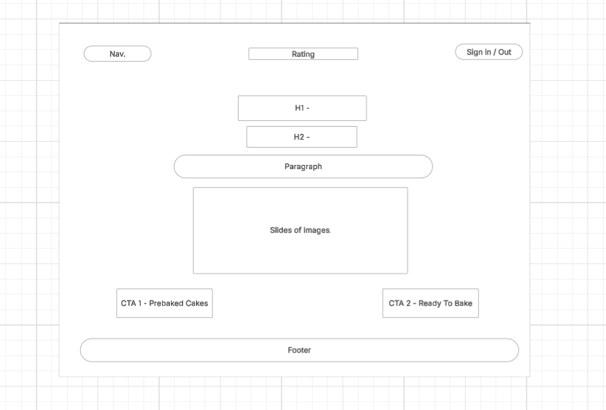

2. About Page - Desktop:

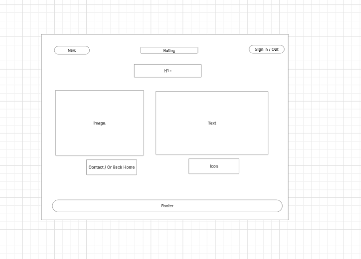

3. Contact Page - Desktop:

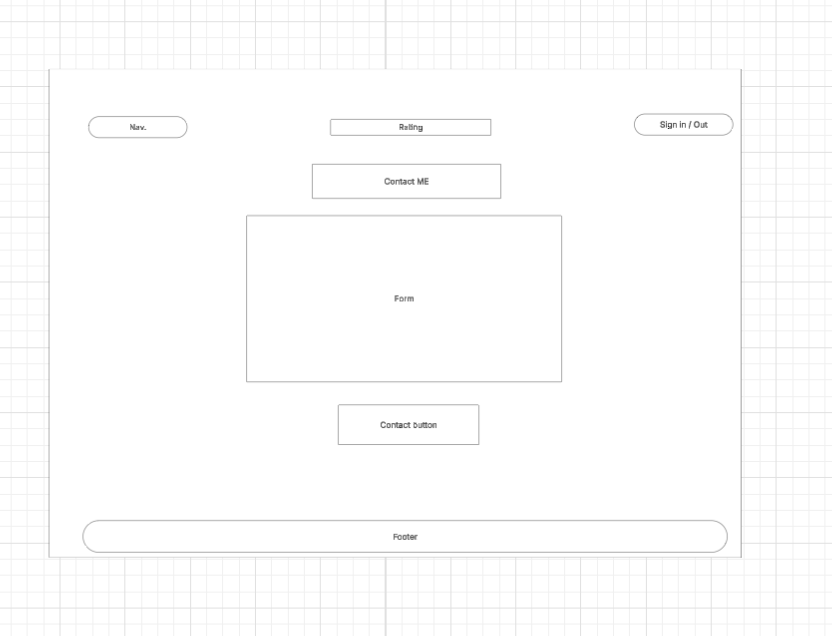

4. Home Page - Tablet & Mobile

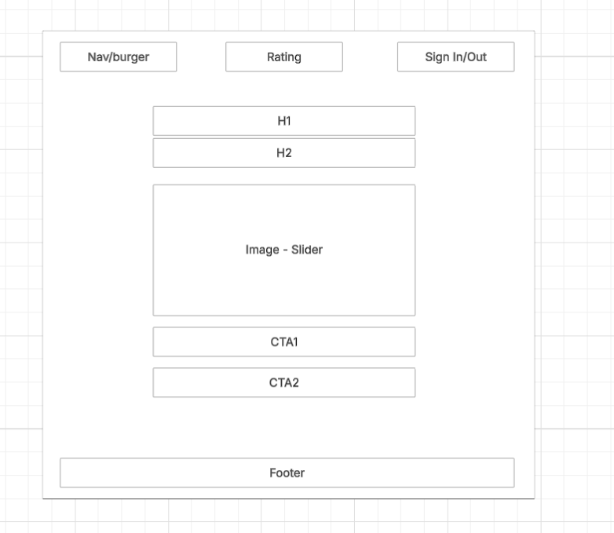

5. Contact Page - Tablet & Mobile

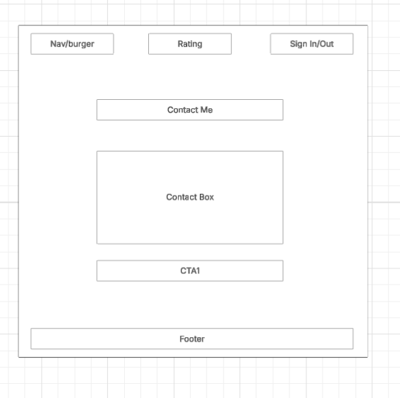

6. About Page - Tablet & Mobile

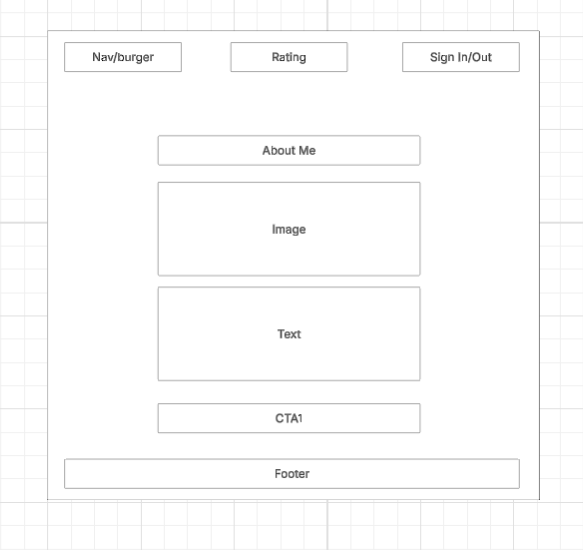

### Database Schema

I used a relational database structur around products, users, orders and reviews. The schema is implemented using Django ORM models and relationships.

The system follows standard e-commerce architecture:

Users can create and manage products (admin role).

Users can leave reviews on products.

Users can place orders.

Orders contain multiple order items.

Each order has a single shipping address.

An ERD diagram is included below.

The project uses Django’s built-in User model from django.contrib.auth

Here is the link to my ERD, created using Lucid Chart: https://lucid.app/lucidchart/c6989dad-7bf8-4550-bf20-189bb77cfb91/edit?viewport_loc=-2010%2C-578%2C3940%2C1903%2C0_0&invitationId=inv_564427e2-7f17-413e-b4b8-1f3b7da38529

There is also a screenshot of it below:

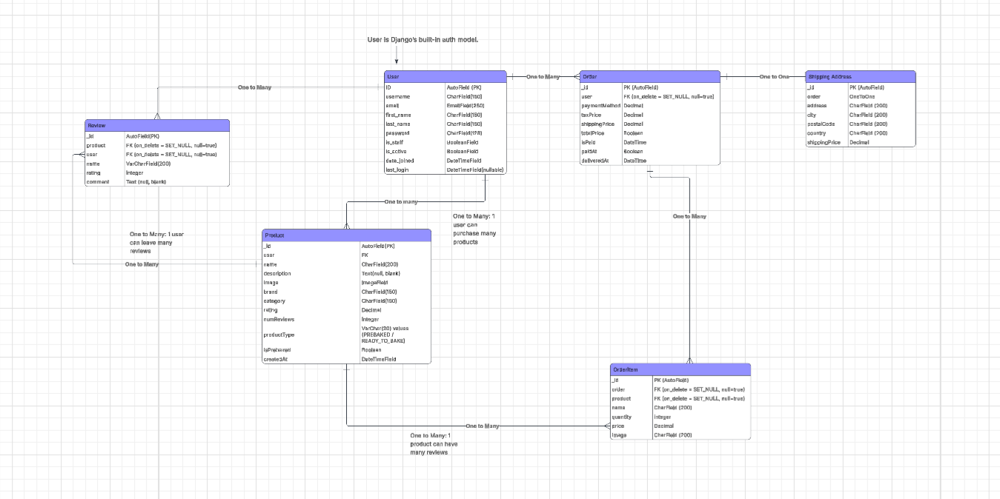

---

**User (Django Auth Model)**

Key fields:

id – AutoField (Primary Key)

username – CharField(150)

email – EmailField(254)

first_name – CharField(150)

last_name – CharField(150)

password – CharField(128)

is_staff – BooleanField

is_active – BooleanField

date_joined – DateTimeField

last_login – DateTimeField

Relationships:

One User can create many Products.

One User can write many Reviews.

One User can have many Orders.

**Product**

Represents items available for purchase.

Fields:

_id – AutoField (Primary Key)

user – ForeignKey → User (SET_NULL)

name – CharField(200)

description – TextField

image – ImageField

brand – CharField(200)

category – CharField(200)

rating – DecimalField(7,2)

numReviews – IntegerField (default=0)

price – DecimalField(10,2)

countInStock – IntegerField (default=0)

productType – CharField (choices: PREBAKED / READY_TO_BAKE)

isPrebaked – BooleanField

createdAt – DateTimeField (auto_now_add=True)

Relationships:

One Product can have many Reviews.

One Product can appear in many OrderItems.

**Review**

Represents user feedback on a product.

Fields:

_id – AutoField (Primary Key)

product – ForeignKey → Product

user – ForeignKey → User

name – CharField(200)

rating – IntegerField (default=0)

comment – TextField

Relationships:

Many Reviews belong to one Product.

Many Reviews belong to one User.

**Order**

Represents a customer purchase.

Fields:

_id – AutoField (Primary Key)

user – ForeignKey → User

paymentMethod – CharField(200)

taxPrice – DecimalField(10,2)

shippingPrice – DecimalField(10,2)

totalPrice – DecimalField(10,2)

isPaid – BooleanField

paidAt – DateTimeField

isDelivered – BooleanField

deliveredAt – DateTimeField

createdAt – DateTimeField (auto_now_add=True)

Relationships:

One User can have many Orders.

One Order contains many OrderItems.

One Order has one ShippingAddress.

**OrderItem**

Represents individual products within an order.

Fields:

_id – AutoField (Primary Key)

order – ForeignKey → Order

product – ForeignKey → Product

name – CharField(200)

qty – IntegerField

price – DecimalField(10,2)

image – CharField(200)

Relationships:

Many OrderItems belong to one Order.

Many OrderItems reference one Product.

**ShippingAddress**

Represents delivery information for an order.

Fields:

_id – AutoField (Primary Key)

order – OneToOneField → Order

address – CharField(200)

city – CharField(200)

postalCode – CharField(200)

country – CharField(200)

shippingPrice – DecimalField(10,2)

Relationship:

One ShippingAddress is associated with exactly one Order.

### Surface Plane

The surface plane includes colour choices, typography, imagery, layout styling, and interface components. I ensured the interface communicates the brand identity of the bakery while maintaining clarity and usability.

**Typography**

Two primary fonts were used to balance personality with readability:

- Lobster is used for headings and prominent titles to convey warmth and handcrafted branding.
- Gochi Hand is used for body text and navigation to create a friendly, informal tone consistent with a small independent bakery.

**Colour Palette**

The colour palette was designed to reflect the warmth and familiarity associated with a small independent bakery while maintaining clarity and readability across the interface.

A soft cream background (#fdf6ef) is used throughout the application to create a welcoming and comfortable atmosphere. This colour evokes the feeling of a traditional bakery interior and helps avoid the harshness.

The primary text colour is a cocoa brown (#6B4F3F), which provides strong contrast against the cream background while reinforcing the bakery theme.

Accent elements use a caramel-toned highlight (#C89B7B), which appears in navigation underlines and subtle interface details. This colour was chosen to introduce a gentle visual hierarchy without overwhelming the user interface.

---

## Setting Up Stripe Payments

To obtain the stripe API keys in order to communicate with the eCommerce store, you need to log into stripe, or create an account. From there, ensure to check the 'Test Mode' icon, to turn it on. 

Then, you should clearly see a section on that current screen titled 'For developers' which will have the PK_test key and the SK_test key, ready to copy. 

NOTE: Never paste these keys into your settings, views, or anywhere that - when pushing - exposes them to github. 

Your keys must be in your env.py file, and that env.py file must be properly stated in the .gitignore file. 

Then, in your urls.py, you need import TemplateView: 

from django.views.generic import TemplateView

From there, you need to add a route which points to the index.html file in the build folder you created when you run 'npm run build'. 

The route is: path('', TemplateView.as_view(template_name='index.html')) - put this in the url patterns.

This index.html file is now where the react app lives, and it will update everytime you run 'npm run build' after every new change you make. 

Finally, in your STATICFILES_DIRS, within settings, you need to let it know that you also have static files in your frontend/build that you created. 

So, add this line:

BASE_DIR / 'frontend/build/static'

**Successful Payment**

Once you have successfuly made a payment on your site (only in test mode), you will see this update on your home dashboard which shows a new payment made today:

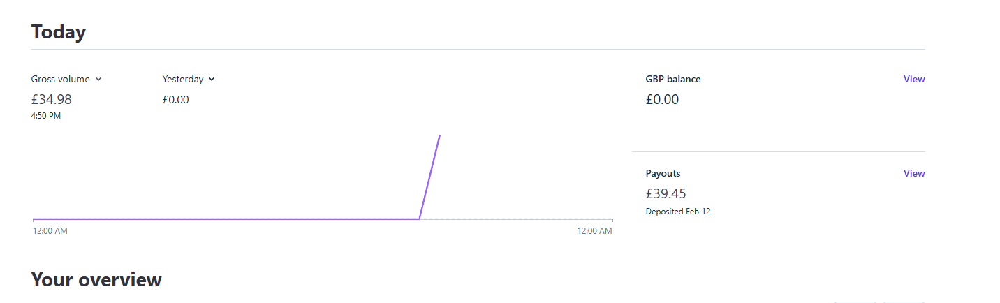

---

## Merging Django & React

To do this, ensure everything is saved, pushed, and all servers are closed, and terminals are shut. 

Then, open your folders, and move the frontend (react) into the backend (Django).

Then, open a terminal and change directory to the frontend: "cd backend" + "cd frontend" - takes you to the new location of your frontend folder. 

In here, type "npm run build"

"Run build" is something you would need to continue to run everytime you make changes to the website. 

From there, you will need to add the following "os.path..." to your 'DIRS' in the Templates section of settings:

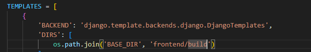

---

## Deployment

Explain how your project is deployed and how someone can clone and run it locally. Expand on this:
1. Clone this repository
2. Open in VS Code
3. Install dependencies
4. Run application

Link to live site: [Deployed Site](https://the-honesty-bakery-29256f22a3f7.herokuapp.com/)

---

## Adding Images to AWS

For this project, I decided to store images in the scalable S3 service by AWS. I did this because this service is designed for durability. 
In the even that the website catches a lot of traffic, then AWS can handle the influx, whereas self-hosting images could cause the website to freeze
or crash.

Storing images in AWS also separates static resources from the application server. This stops the backend from needing to use up resources to host them.

The process to set this up:

1. Head over to aws.amazon.com.
2. Create a new, free account - you will need a card. 
3. Select the 'S3' service, which is on the front dashboard. 
4. On the next page, choose 'Create a bucket'. 
5. Name your bucket something relevant. 

6. Afterwhich, you will need to untick the box which says 'turn off all public access'. The reason for this, is because you need the public to 
   see your images. Just ensure you never store any private information in the bucket.

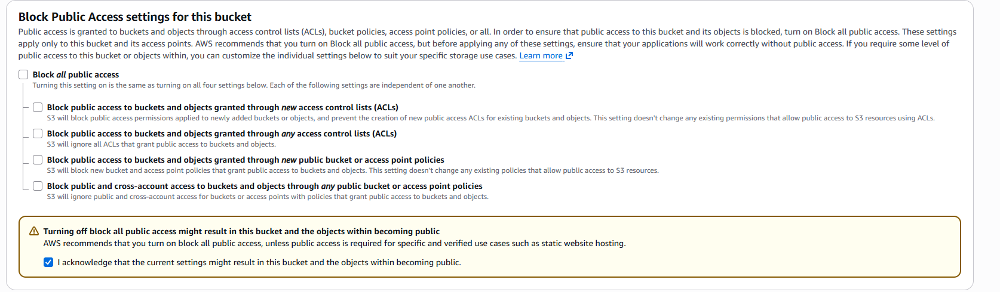

7. After that, scroll to bottom and click 'create bucket'. 

8. Next, navigate back to your bucket by clicking on its name, click 'upload' and you should be taken to another screen. In that screen, click 
'add files'. Here, you will be able to upload a folder or the images - I selected all the images for upload. 

9. After that, I created a bucket policy that allowed me to view the images. To do this:
- Go to your bucket. 
- Click on 'permissions'. 
- Under bucket policy, click 'edit'.

This is the policy I created:

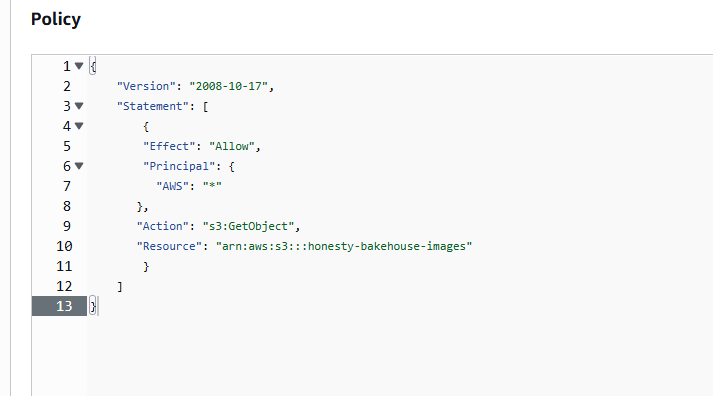

10. I then went to the Django stores to get the command I needed to install s3:

"pip install django-storages[s3]"

Once that is installed, you then need to add this to your settings: "DEFAULT_FILE_STORAGE = "storages.backends.s3.S3Storage""

Which can be found here: https://django-storages.readthedocs.io/en/latest/backends/amazon-S3.html

Then, add 'storages' to your list of installed apps.

11. Type 'IAM' into the AWS search bas, and click on it.

Click 'users' on the left panel. then 'create user' on the right.

Clcik on 'attach policies directly'. Type s3, then click 'Amazons3FullAccess'.

12. Once that is setup, go back to your new user you created by clicking their name. 

- On this dashboard, you should see an option to 'create access key'. So click that, and when I did, I was taken to this page:

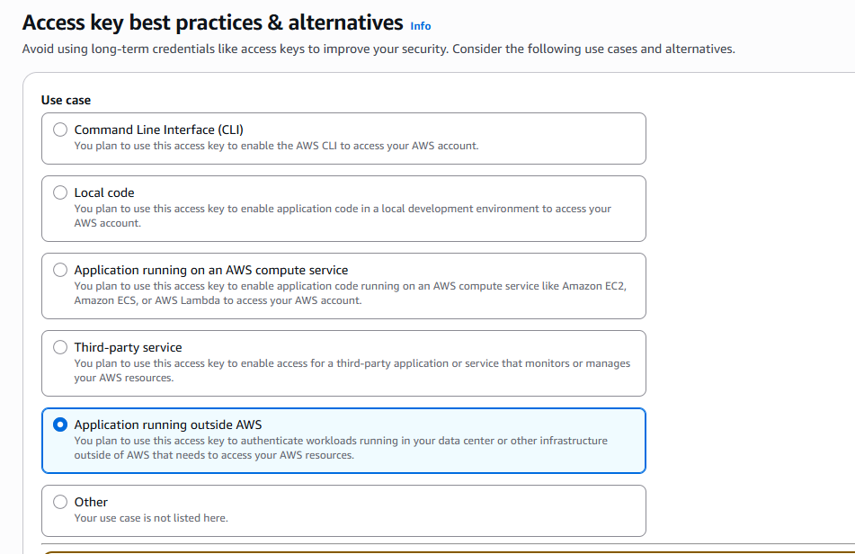

The reason I choose "Running outside AWS" is because the website is hosted on Heroku. 

Ensure all of your keys are placed in the env.py file, and that this specific file is listed in 'gitignore'. 

After that, place your user access key and secret key in the 'config vars' section of Heroku. 

Now, when you upload images on the honesty bakehouse website, they should be hosted directly on AWS. 

---

## Testing

### User Stories Testing

List your user stories and describe how each was met in the final project.

### Manual Testing

- Navigation
- Responsiveness
- Browser compatibility
- Forms and interactivity

1. One of the first manual tests carried out was to click on one of the products displayed on the homescreen to see if the productScreen.js renders properly. For this to be successful, it needs to take you to a new page (not open a new one), show the 3 collumns (image, price, and details). 

I first Clicked on the 'Birthday Cake':

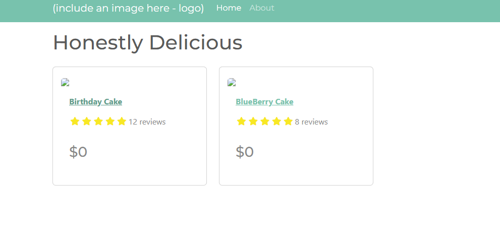

As you can see, it rendered successfully (excluding image fail).

2. The second manual test was to see if the if-statement properly checked if the product items are in stock. You can see the code below:

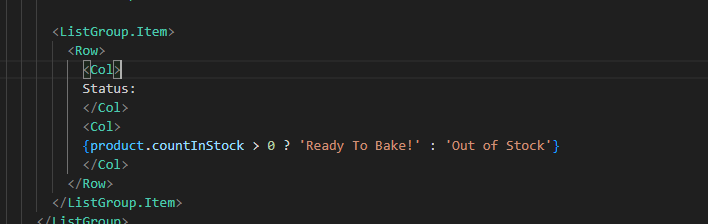

After saving and refreshing the live server (npm start - since it's react), the product screen showed 'Ready to Bake!' since I had set the stock to be greater than zero. 

Status:
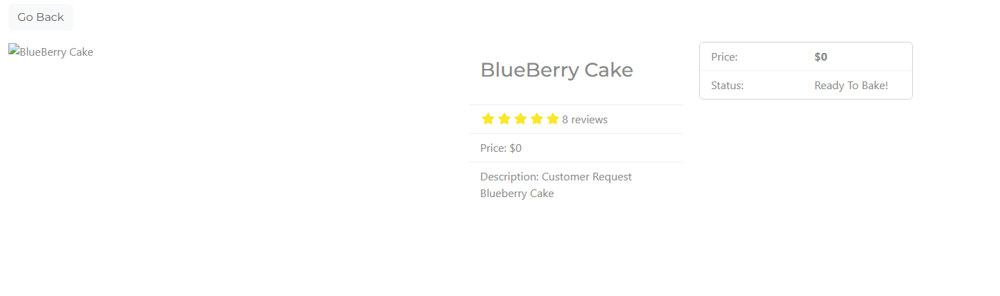

Product.js showing stock as 1:
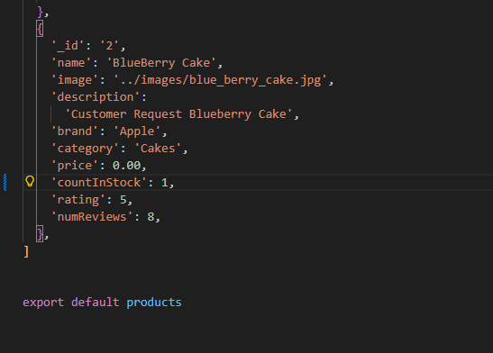

#### Checkout Testing

1. 'Add to Cart' button:

Clicking the 'Add to Cart' button took me straight to the cart page, displaying the total in the basket and total amount.

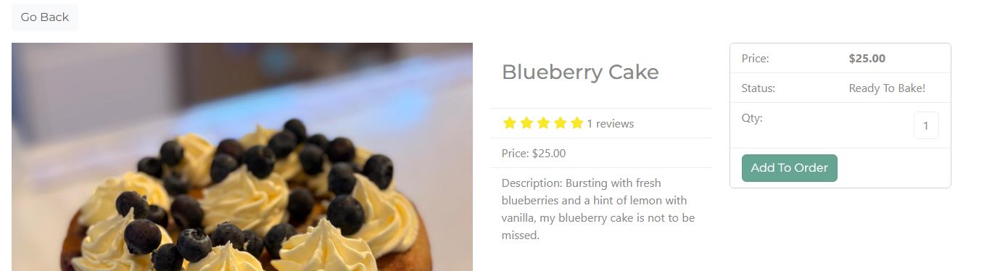

Cart page:

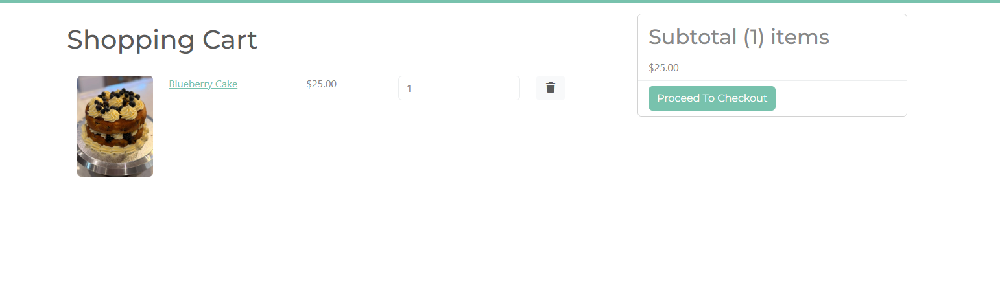

This all worked fine, however, I decided this wasn't best for the user experience. My plans moving forward were to create a notification that pops up for 5 seconds, showing that the item is added to the cart, but they stay on the same screen (unless the user clicks on the cart icon to go to the cart screen). 

This would make for a better experience, because the user wouldn't then have to keep clicking out of the cart screen if they wish to purcahse more products.

#### Login Testing

I attempted to log in after successfully registering a user (**include this above**), and I was met with an error 400 response. 

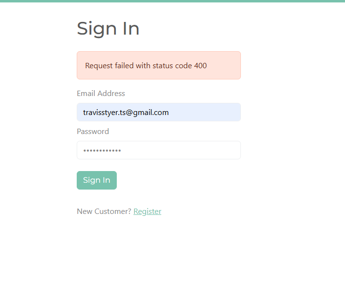

I checked the 'Network' tab in dev tools and tried to log in again, and found the error 400 in userActions:

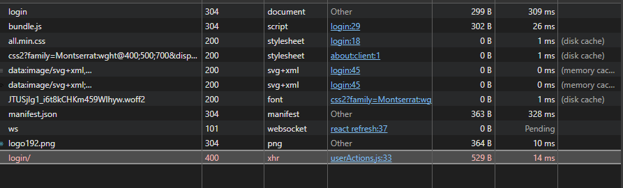

Solution:

Change user_name = 'email' in views.py. After that, it worked:

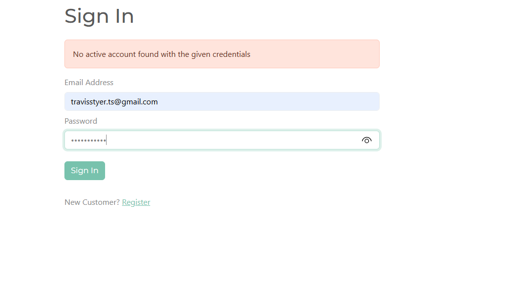

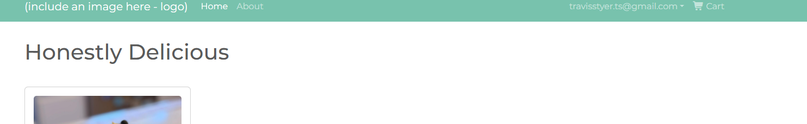

#### Login to Checkout Testing

1. I first successfully logged in:

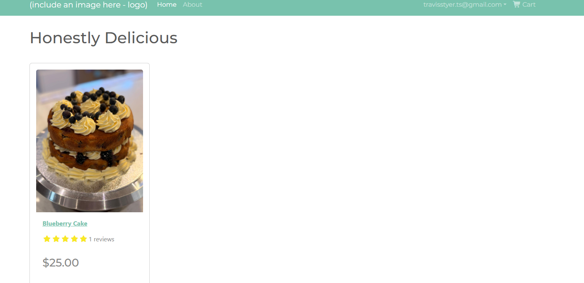

2. I then added the single item to my basket:

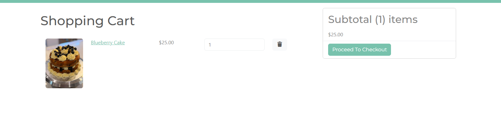

3. I then clicked on checkout:

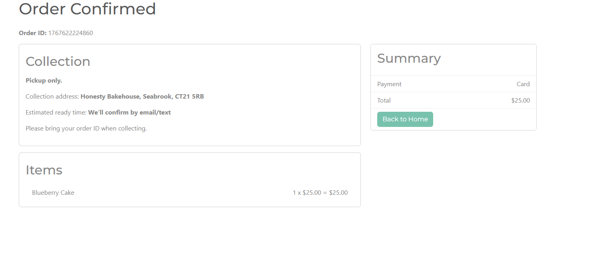

### Python Testing

All Python code in this project follows the PEP 8 style guide. The use of PEP8 allowed me to keep my Python code consistent and readable. To add PEP8, you need ensure you are operating within your virtual environment:

To add PEP8 to your project, it's essential you are operating within a virtual environment. 

1. Navigate to the Command Palette (Ctrl+Shift+P / Cmd+shift+p)

2. In the top navigation bar, you will now be able to find 'Venv'. Select it. 

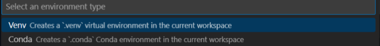

3. From there, you will need to select your desired interpreter. I chose to use 3.12.8, which is needed for this project. 

4. After selecting the desired interpreter or Python version, a notification will show the progress of the environment creation and the environment folder will appear in your workspace.

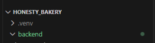

5. When operating within your virtual environment, you will see this at the far left of your terminal:

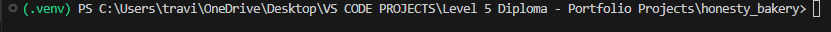

If you do not see that, you will need to be within the project root/or where your .venv folder lies, and type this into the terminal:

- ".venv/Scripts/Activate"

You should then see the green (.venv) appear at the beginning of the commond prompt line. 

6. Once you are within your virtual environment, then you can add PEP8 by searching for it in the extensions or via the terminal:

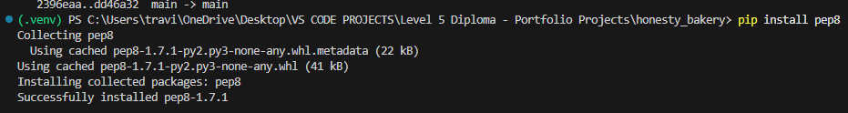

#### Testing with PEP8

PEP8 is the official Python style guide. To test that the project follows PEP8 standards, the `pycodestyle` tool was used.

##### Installing pycodestyle

In the terminal, install pycodestyle:

pip install pycodestyle

##### Running PEP8 tests

Individual files can be tested using:

pycodestyle path/to/file.py

For example:

pycodestyle base/views.py

The following files were tested and passed without errors:

- base/views.py

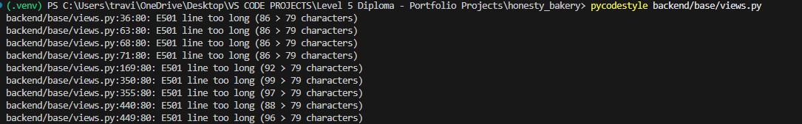

This result shows that my lines of code were simply longer than recommended, but no errors were present.

- base/models.py

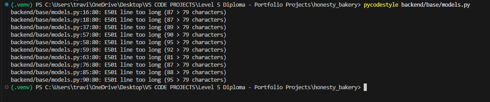

- base/urls.py

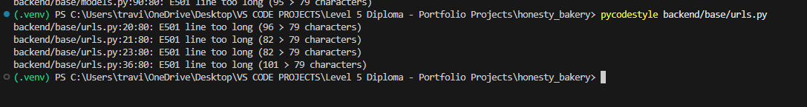

- base/serializers.py

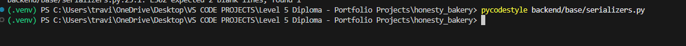

- base/products.py

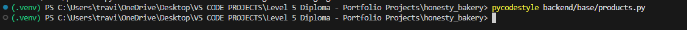

- base/apps.py

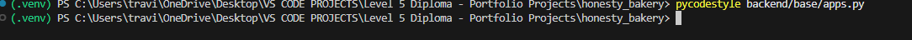

- backend/backend/urls.py

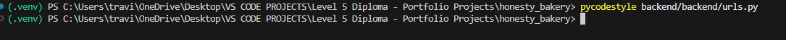

### PyTest

PyTests is a TDD tool I used to test my pure python, so I wouldn't need to import unittest in the test file that I would do when testing views or models. 

I used PyTest to rest the functions in the services file. 

1. First, I installed PyTest with this command:

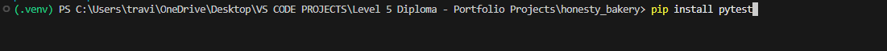

(Type pip3 install pytest for mac or Linux)

2. I then installed PyTest Mock:

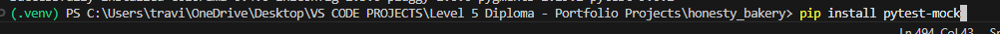

This will help you mock functions in the test.

3. Then, I created a test_services.py file. 

This file would contain multiple tests for the services.py file functions. 

The first thing I did was "import pytest".

Before writing any of the tests, I first learned that it's important to structure each test by "Assigning", then "Acting", and finally "Asserting".

Assigning will be assigning data. Acting will be using it. Asserting will then test if the output is true or false.

#### Running The Pytests (TDD)

First, I created a pytest.ini file located in the same directory as my manage.py file (backend).

Add the below inside the file:

"""
[pytest]
DJANGO_SETTINGS_MODULE = backend.settings
python_files = test_*.py

"""

In your terminal, ensure you are in the directory that holds manage.py. Simply type "pytest (location of your single test)". For me, that was "pytest base/tests/test_services.py" in the terminal. 

For me, I received an error (not a fail or pass). It says that my syntax was incorrect, so the test couldn't even run:

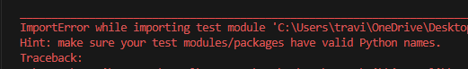

To amend this, I corrected the import on my test_services.py file: 

"from services import validate_contact_form"

changed to:

"from base.services import validate_contact_form"

The services file was in a directory above the test file (base).

#### First pytest

I then ran pytest base/tests/test_services.py and recieved the following fail:

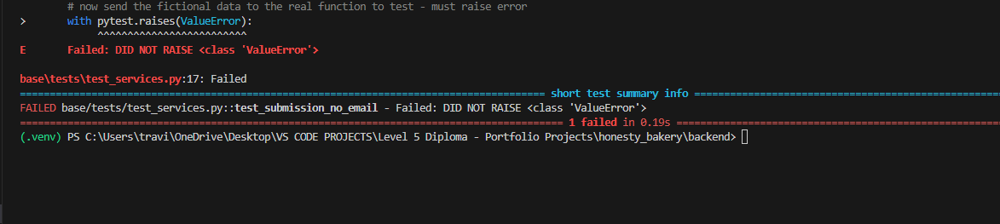

It entered the red state because the ValueError did not raise. This is correct, as this test is specifically looking to see if the ValueErorr raises when the user does not enter their email. 

To fix this, I adjusted the function so it would account for the missing email by raising and error when it finds that the email field is blank. 

To do this, you can check for all falsey values with the code "If not email: raise ValueError("Please provide an email")" - that is what I specifically used.

"If not email" basically checks if email is falsey. Falsey is an empty string, empty brackets, "None", empty braces, etc.

This screenshot shows the commits made when building this simple test. I've included it as I realised I should've stated either "Red State" or "Green State" in them. 

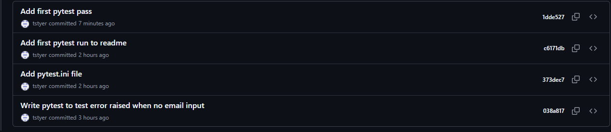

The commit "Add first pytest pass" should include "Green State: ..."

The commit "Add first pytest run to readme" should say "Red State: first pytest fail added to readme."

#### Second pytest

**Red State**

My second test was based on raising an error if the subject line was left empty. I wrote the test, but it was in the redstate as I had not yet updated the function:

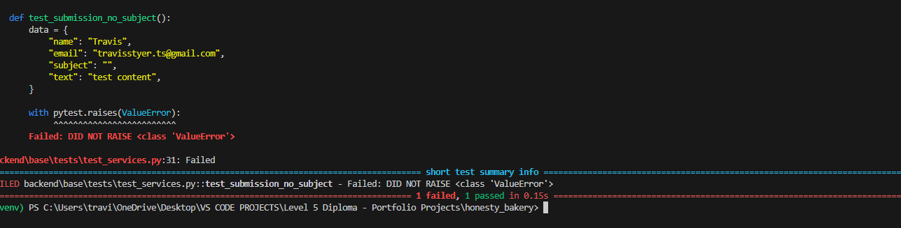

**Green State**

From there, I modified the function to take the subject line from the fiction data in the test, and then specify "if not subject:..." (if 'subject' is false), then raise an error. 

This then passed, as the subject line was empty - false. 

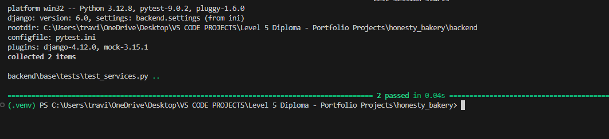

#### Third pytest (fourth test down in test_services)

**Red State**

Lastly, I created a test to see if the function would raise an error if the text field was blank.

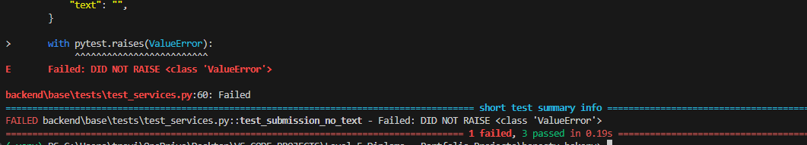

**Green State**

After modifying the function, it passed:

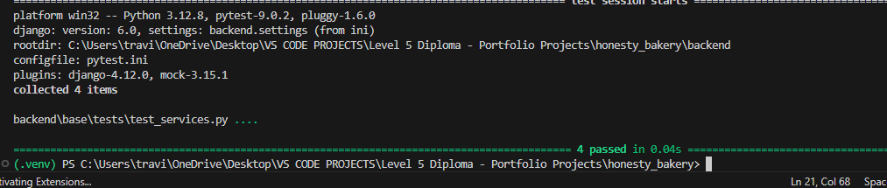

----

### Jest Tests: TDD (before code was written) and Unit Tests After 

**Testing Strategy**

I intend to demonstrate a TDD environment with the main JavaScript screens and components. 

Throughout running the tests, I always only test one or a few at a time using "test.only" or typing the test names. This is to ensure I focus solely on building single parts of code cleanly. 

**INCLUDE 'NOTE' MESSAGE BELOW, HERE**

#### JavaScript / React TDD

I began by writing tests before any code for each of the following screens, funcions, and components. 

To begin, you can see my Test code in ErrorScreen.test.js before ErrorScreen.js existed.

1. **Error Page**

I first created the test file and added imports:

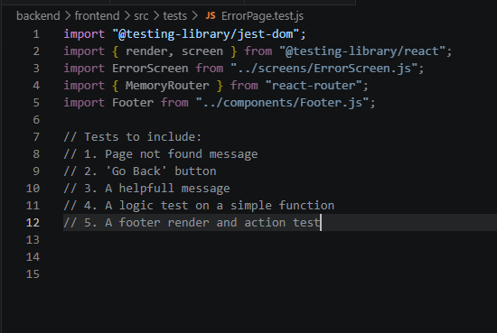

**Page Title: Red State**

I then wrote the first test and ran 'npm test ErrorPage'. I was in Red State due to failure because the ErrorPage.js did not exist yet:

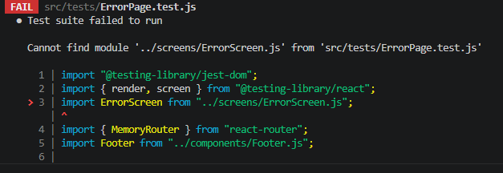

This was also true for the other tests I created before ErrorPage.js existed.

**Page Title: Amendment**

This was a minimul test, so they only thing I needed to do to satisfy it was to add a H1 and content in it:

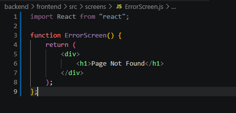

Then, when I ran this test (only), it entered the green state. 

**Page Title: Green State**

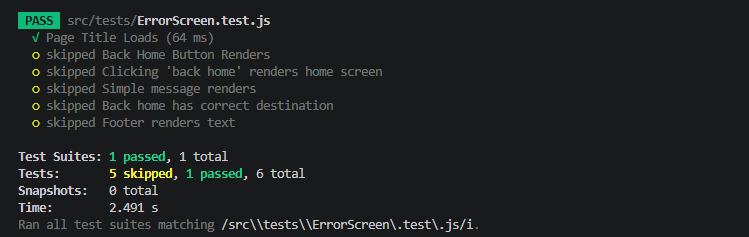

I then added "oops!" to the beginning of the H1 to see it it still passed, and it did:

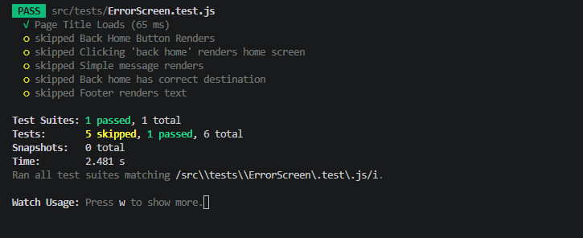

**Back Home Button Display: Red State**

Since the ErrorPage was non-existent, the test failed because of the imported file ErrorPage. I also used 'test.only' on this second test so it ignored the first one in red state. 

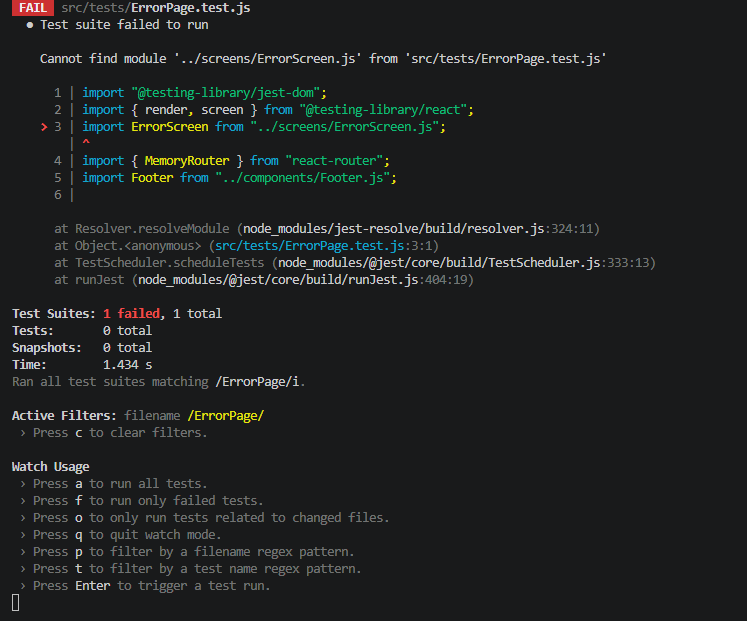

I then entered the basic syntax for the 'Go Back Home' button, and the test passed:

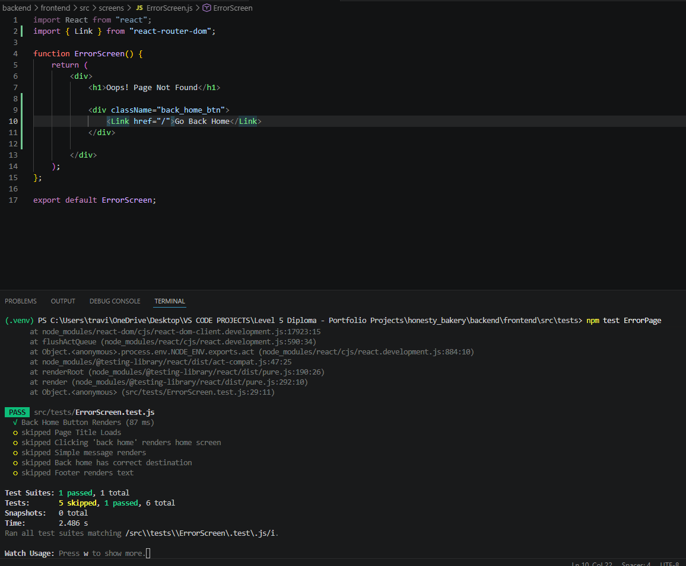

**Go Back Button Functionality: Red State**

Since the ErrorPage was non-existent, the test failed because of the imported file ErrorPage. 

This test was written to prove that the URL changes when you click the 'Back Home' button. 

It is also a test with an async function in it  because I need to use 'await'. This it because I need to wait for the 'back home' to be clicked to render the expected result. 

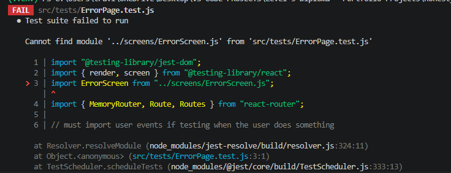

This is just an image of the test which shows the use os async, await and my comments:

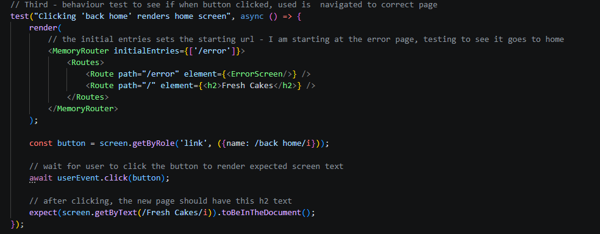

Note: After adding the basic syntax for the button, I needed to change 'href=' to 'To="/"', then test passed:

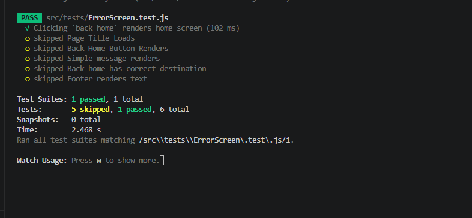

You can see it states "... back home renders home screen" in the image above. 

**Simple Message Displays: Red State**

Since the ErrorPage was non-existent, the test failed because of the imported file ErrorPage. 

**(Include further reasons for red state)**

After adding a simple message, this test passed:

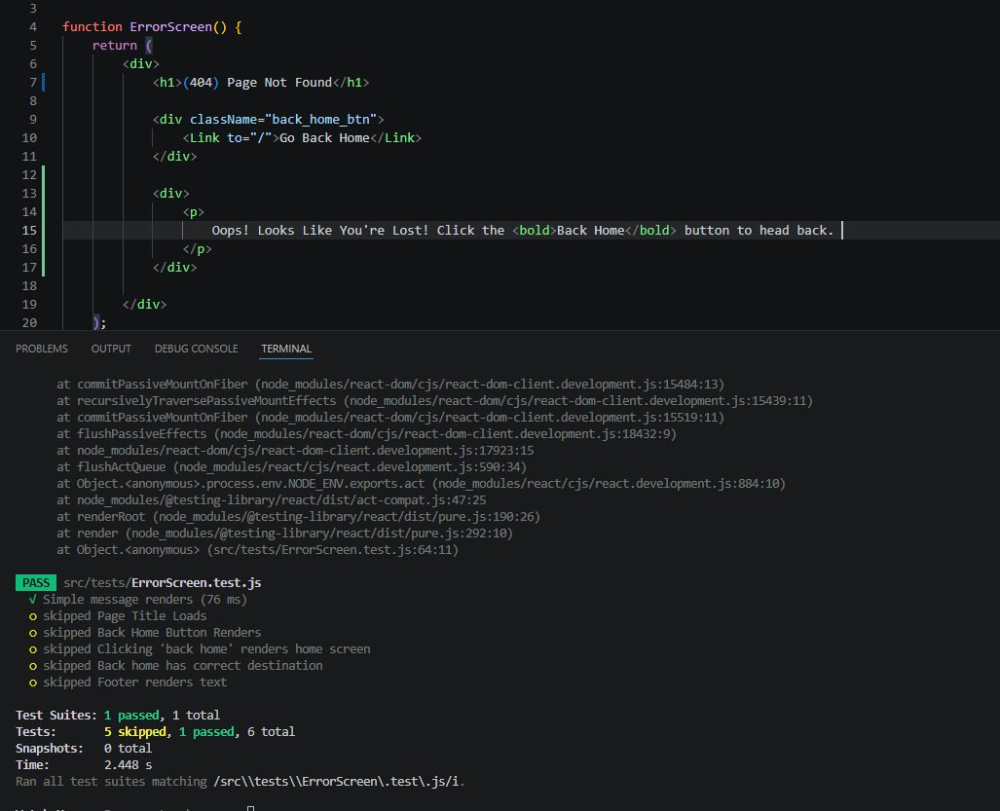

**HREF/TO link in Back Home button shows as '/': Red State**

Since the ErrorPage was non-existent, the test failed because of the imported file ErrorPage. 
**(Include further reasons for red state)**

Following creation of the 'Back Home' button, this test passed, given I used the React-Router 'Link' with an attribute of 'To="/"':

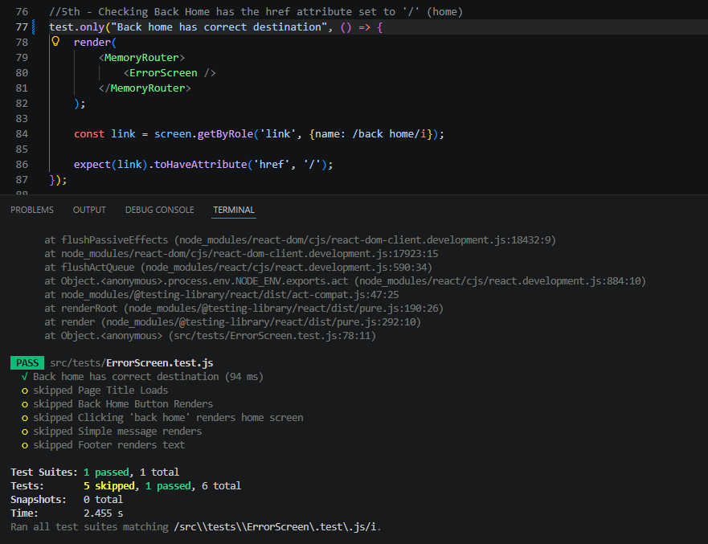

**The following tests are done by initially removing code from the pade that is being tested. Then, I will write the test, run it (Red), re-enter the code (modified - unlike original), run the test again (Green), and proceed to the next.** This method is done to try and attain a complete TDD for React which, as mentioned before, should have been implemented at the start. 

2. **Footer Component Tests**

**Footer Socials Text: Red State**

For this component, I removed the entire social block. You can see it failed because there was no socials within it - completely removed for TDD:

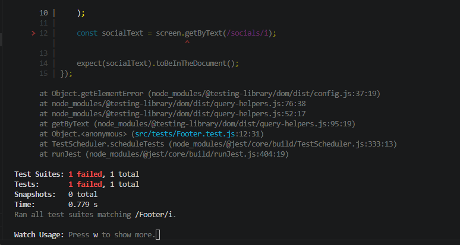

After re-adding the footer, this time with aria-labels and using 'ClassName' instead of 'Class', the first test passed, showing the socials display:

**Footer Socials Text: Green State**

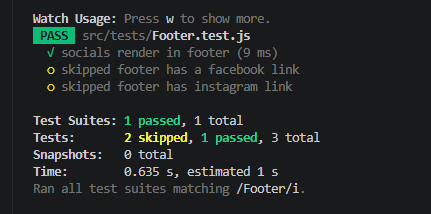

**Footer Facebook Link: Red State**

This failed due to the socials component missing in the file. 

1[Screenshot of fail](./backend/frontend/public/images/jest_tests/tdd/footer/facebook_link_fail.png)

After adding the new footer, the facebook link test passed:

**Footer Facebook Link: Green State**

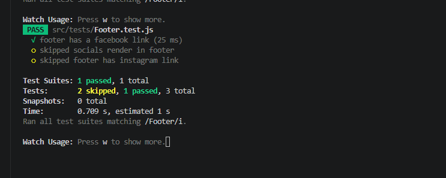

**Instagram Link: Red State**

This failed due to the socials component missing in the file. 

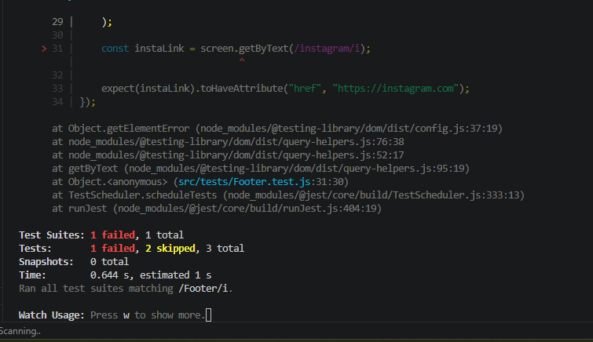

The same is true for the Instagram link: once the modifed footer was added, the test passed, as seen in the commits. 

3. **Header Component Test**

As I did with the footer, I removed a large section of the header. This was the Redux/Router behaviour. 

I ran 5 tests with the header, each test was run on it's own using '.only' and they began in the red state, until I slightly amended the heading, ensuring that it is different to the original, and then each test passed. 

The Red and Green states of the tests are evident in the commits, and the header component is also different to the original, capturing a TDD phase.

--

**Alt Text Test: Red State**
Test dails due to only having "logo" in the Alt text. 

**Alt Text Test: Green State**
Test passes after adding new alt text. 

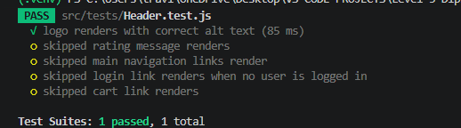

--

**Header Rating Section: Red State**
This is the second test that fails due to missing rating section in the header. Noted in the commit. 

**Header Rating Section: Green State**
This second test now passes after adding the new, **amended**, rating section to the header. 

--

**Header Home Nav Link: Red State**
Fails due to a missing nav component - home. 

**Header Home Nav Link: Green State**
After adding the new head 'Home' nav button, it passed:

--

**Header Login Test: Red State**
Fails due to missing login section.

**Header Login Test: Green State**
Passes by simly re-adding the login section with a no Redux present - just minimal to pass. 

--

**Header Shows User name When Logged In: Red**
- Functionality does not yet exist. 

**Header Shows User Name When Logged In: Green**
- Functionality added to Nav Bar.

--

**Header Allows the Logout Function: Red**
- This functionality was not yet in the header code. 

**Header Allows the Logout Function: Red**
- Test passes now I've added the logout functionality. 

------------------------
(AMEND THIS WHOLE SECTION, INCLUDING THESE POINTS:)

Add a section like:

Test strategy
TDD examples
Unit tests

**You need to show:**
**what was tested**
**why it was tested**
**what type of testing was used**
**which behaviours were developed test-first**
--------------------------

**IMPORTANT:** I have only done a proper TDD environment for the error page. This is because, mistakenly, I hadn't written unit tests during the beginning of production for the rest fo the app to create a true TDD. Thus, I have not benefited from fully building a project in a TDD environment. However, This is something I have now learned from and I have been writing new unit tests for React for a lot of the components in this project. They begin in the red state and follow through to green state with amendments on the code and tests, knowing that the code needs to satisfy the test in order to be used. **The only page where true TDD is carried out is the error page, where tests were written before any code. This is to show that, although I should have done this from the beginning, it is an aspect of development I have still learned, practiced and will endevour to produce a TDD properly in my future projects.**

1. **Hompage Tests**

#### Hompage Headers

First, I ran simple Jest tests to seeif ym React and Javascript was written well, even though the code already renders the result I want. 

I used mock.jest in a separate test file to mock the DOM and react-redux environment. 

Here, you can see the reason for failure of the first test:

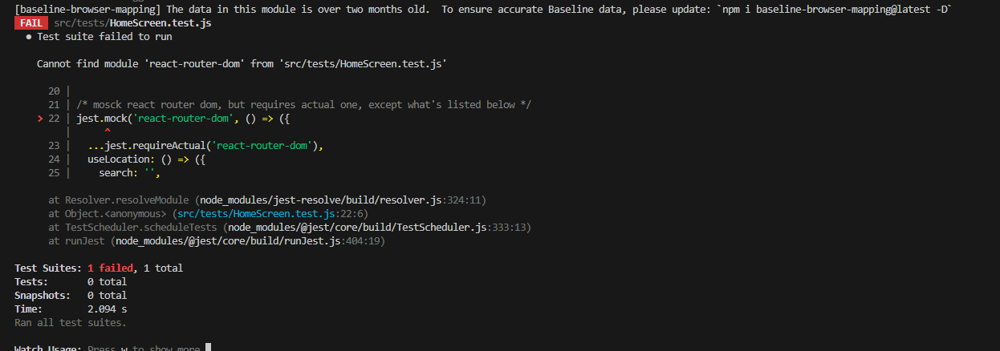

It says react-router-dom is not found, even though it is installed correctly. 

One of the reasons this test didn't run properly, was because I realised I needed to define my mocks before I import the homescreen. 

Secondly, I had to remove the "import test from "node:test";" from the top as it it not Jest. I deleted it and relid on Jests built-in function (test...).

After that, I had to ensure the Mocks were created first before the imports. This is because if HomeScreen loads before my imports, it will have tried to load Axios and crashed. 

After making those changes, the first test passed:

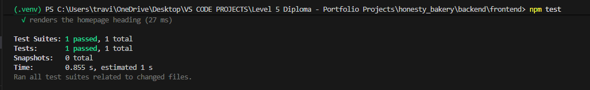

#### "<Loading >" Component Renders

This test is built to see if my Loading component renders when Redux says "Loading: true".

For this, I simply changed the initial mock section in homeScreen.test.js from 'loading: false' to true.

Then, I added a new test below the first one. 

First fail:

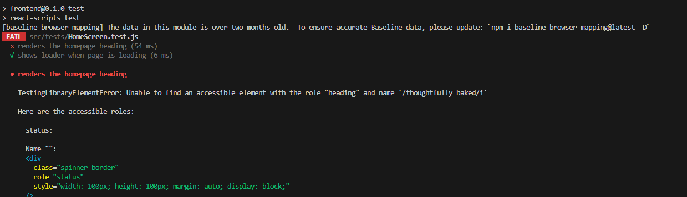

To ge this to pass, I had to create two separate returns for the 'useSelector'.

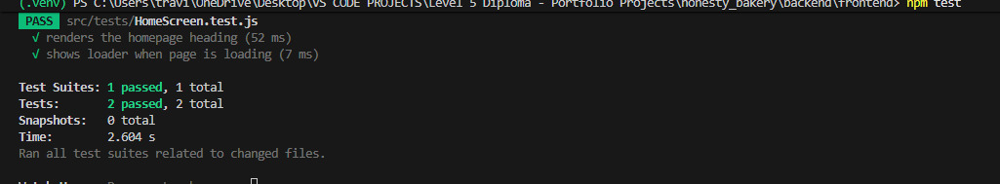

NEW TESTS: Following resubmission failure to create a full TDD environment. I hope this new tests show my ability to create a TDD env. 

2. **CartScreen.js Tests**

#### First Test: Heading Text Renders

- Red State: after writing the first test and running it with 'npm test CartScreen' in the frontend folder, it failed. This is because the test was not isolated enough from other imports on the CartScreen.js page. You can see this below, where it also tried to use axios for the test:

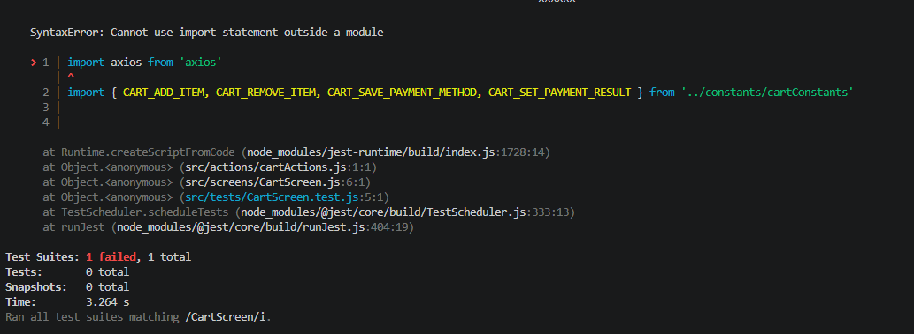

Then, after adding mocks of the react actions, redux and hooks, and also changing 'getAllByText' to 'getByText', so it doesn't return an array, it passed:

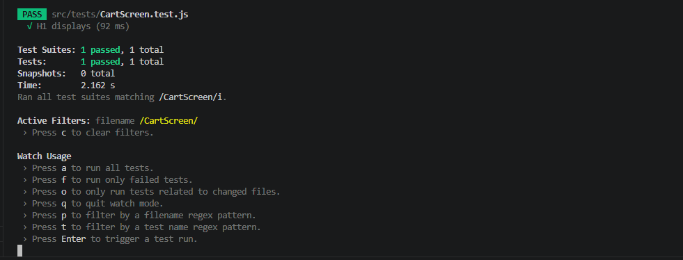

#### Second Test: Img & Alt Text Renders Correctly

This second text was to see if the image and alt text renders correctly. After writing the test, it failed because the alt text (for testing) was not present in the Redux Mock. 

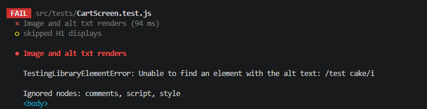

After adding the alt text to the Redux mock environment by including an object in the array of "cart: { cartItems: [ ... ]":

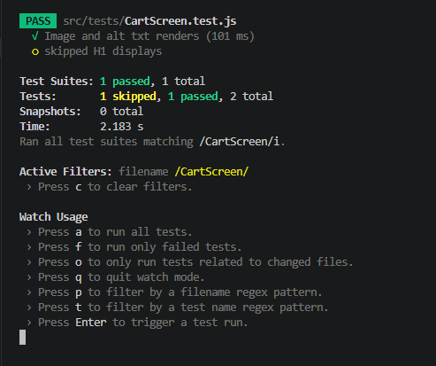

**NOTE:** To only run a single test in this file, I appended ".only" after "test" for this test. I then removed it and appended "only" to the following tests. 

3. **AboutScreen.js Tests**

#### Testing Title Loads

This is the same as the test I did on the CartScreen, however, I do not need to mock Redux or Actions here as they aren't included on this page. 

You can see the initial failure of the test, which was to successfully see the heading is in the document:

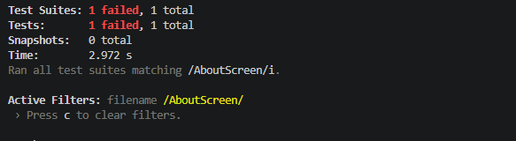

Fix: Adding 'MemoryRouter' to wrap the rederred screen:

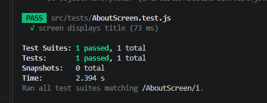

### Django Tests

The first thing you should do when writing multiple tests is create a test file.

Since my app name is called 'base', I put the folder in there. 

1. URL Test

For the first test, it was to see if my 'routes' url exists and confirms it loads correctly. 

Then, where my manage.py lives, I ran: python manage.py test.

This was the result on the first test:

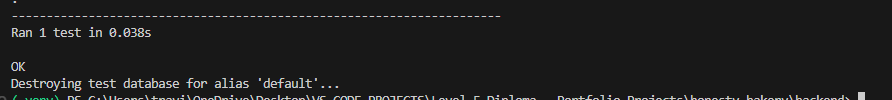

2. Testing Product List endpoint Returns 200

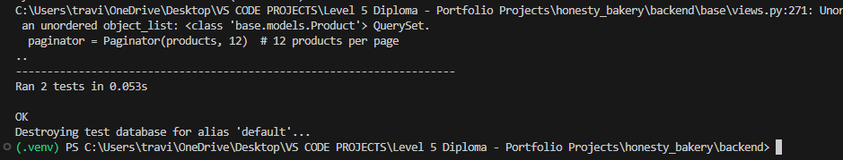

### Validators and Tools

(**INCOMPLETE SECTION - CODE VALIDATION**)

- HTML Validator
- CSS Validator
- Lighthouse Report (Accessibility, SEO, etc.)

(**INCOMPLETE SECTION - CODE VALIDATION**)

## Using Redux

I chose to use Redux in this app, firstly to learn how it's used, but also because I would end up having many pages that would require a global state. This global state is share in the Redux store and passed down to other pages. 

Having learned the importance of Redux in front end when it comes to building larger apps, I am glad I have included it. I will continue to learn more about it in my future project, but here are some examples of how to install and use Redux:

### Installing Redux

...

### Using Redux

## Installing + Using Stripe

In your terminal - in the backend - type: pip install stripe (for windows).

And for the frontend: npm i @stripe/stripe-js @stripe/react-stripe-js (assuming you used React, like me)

Then, follow these steps:

1. Add stripe secret key settings:

STRIPE_SECRET_KEY = os.environ.get("STRIPE_SECRET_KEY", "")
STRIPE_PUBLISHABLE_KEY = os.environ.get("STRIPE_PUBLISHABLE_KEY", "")

## Installing Font Awesome

When building a site with React, the simplest way to install and use Font Awesome is to install it using the terminal. 

1. From the root, type 'npm install @fontawesome/fontawesome-free'.
2. Then, to use icons, you simply start by creating an icon (<i></i>) section. 
3. Within the opening tag, you type in the 'className' of the icon you want to display. Or, you can somply copy the html from the font awesome website.

Example: These 'i' tags were copied from the free icons section in Font Awesome.

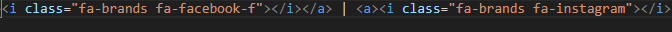

### Bugs

#### Frontend Bugs

1. Product Display Bug

The above image shows a classic bug caused by using Javascript Style comments within a JSX sextion. To remove this problem, I simply put curly braces around the Javascript style comments within thye JSX section, and it was resolved. 

Here it is fixed:

2. Product Screen (First bug)

The error is clear - 'Product' is not recognised. So, to solve this, I did some searching and found that the error was simple: misspelled 'product' as 'Product'. 

So I changed it to as lower-case p, and it worked:

3. Go Back Button

This above image shows a blank screen, but there should be a 'Go Back' button listed, as that is what I had coded to be returned on this page. I learned that this was due to the spelling of a className used in the link: 'btn-Light' should be 'btn-light'. 

Solved:

4. 500 Error

This bug was the result of my images not displaying on the home screen. 

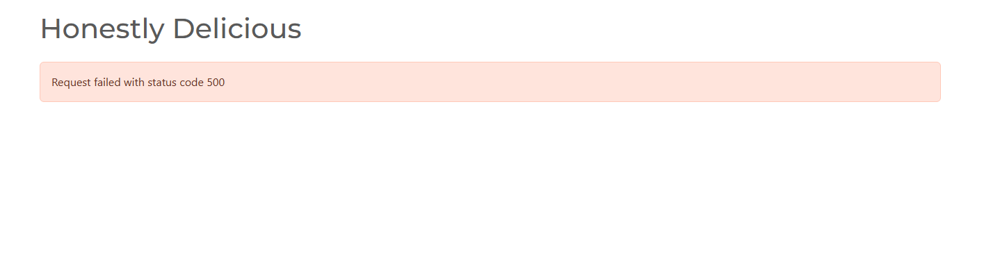

The solution to this was found by the errors notes in the console:

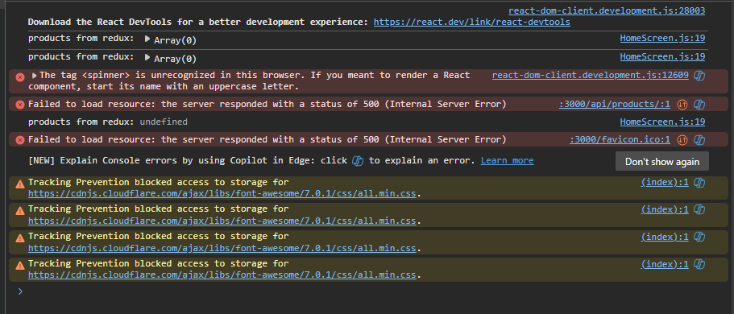

This was solved by changing the 's' in 'spinner' to uppercase within my "Loading" component. 

Solved:

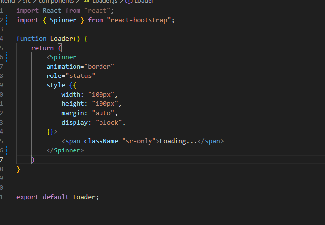

5. Adding To Cart

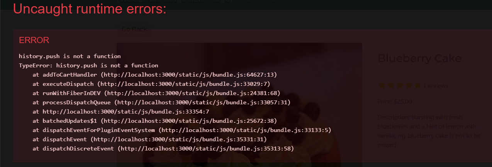

I learned that in V6, there is no 'history.push' function. So I had to rewrite my code. Google AI informed me that 'navigate' is used as a replacement.

Once that was replaced, it worked, and I continued with the manual test of adding to cart. 

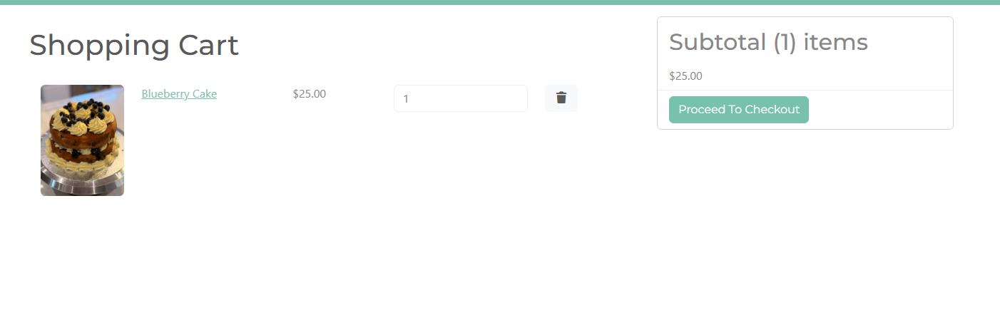

#### Backend Bugs

1. Axios Bug

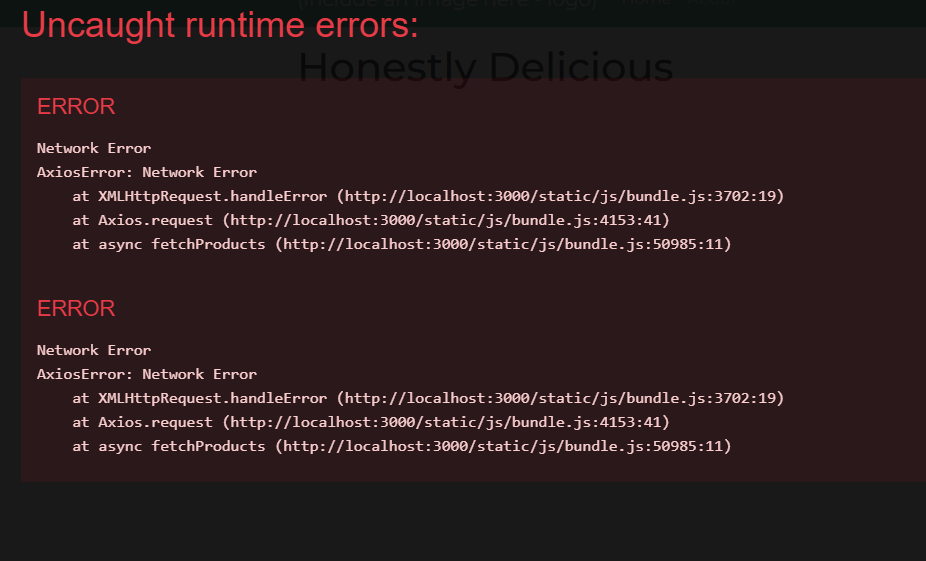

After some research, I learned that this bug means that my request never reached my Django API. 

--- 

### Setting Up Virtual Environment

Before you begin any work on the backend, it's best to set up your virutal environment. To do this, type the command "pip install virtualenv" into your terminal. Once installed, you are ready to activate the virtual environment. 

The screenshot below shows how this is done in the terminal:

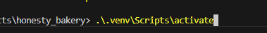

Then, once activated, you will see ".venv" at the far left of your terminal:

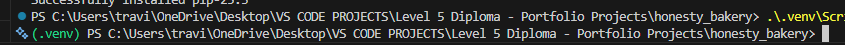

Following that, you'll want to install django with "pip install django", and this will install the latest version:

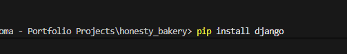

### Creating Django Project

Once installed, you will then want to create the backend project using "django-admin startproject (projectname)"

I called mine 'Backend', so you can see it successfuly created below ".venv" in this screenshot:

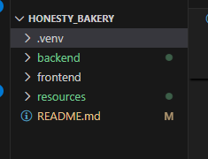

### Creating Individual Apps

Once Django is ready, it's time to start creating backend apps. Before you do this, you will need to change into the project directory. For me, this command is "cd backend" from the root directory. 

Then, you will need to type the command "python manage.py startapp (appname)":

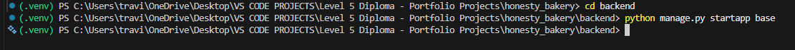

### Writing Your First View

When it comes to ensuring the backend project is connected to your backend app, you need to test that using a basic view and url pattern. I did this by first writing a view called getRoutes and returning 'Hello World.' 

Once that view is written, I then created a urls.py folder in the only app I have ('base'), and then importing that view I just created. 

I created the url pattern which states that when hitting the homescreen (''), I render the view getRoutes, and I gave it the name "get-routes". 

However, this wouldn't work just yet; I needed to connect the urls I created in the app to the main urls.py file in the backend project (called 'backend').

To do this, first add 'include' to the list of imports from django.urls. 

Then, add a new path to the urlpatterns. This will be as shown in the below screenshot:

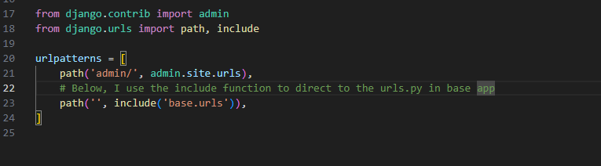

### Using Django Rest Framework

The reason I decided to do this was because the Django Rest Framework will make my api's more powerfull. 

To install it, type this into your terminal: "pip install djangorestframework".

Once that is successfull, add 'rest_framework' to your installed apps section in settings.py. 

From there, you will need to head over to https://www.django-rest-framework.org/, and click on views, under the 'api' section:

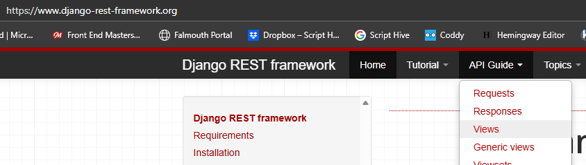

Then, on the right hand side of the screen, click on 'api_view' and copy the highlighted text below to then paste into the views.py in your app:

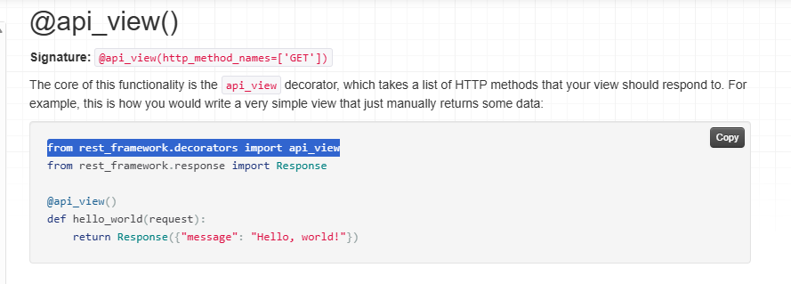

Once you've added that, you will also need to import 'Response'.

## Amending Backend Data

To amend your backend data, you will first need to be able to log into the Django admin panel. To do this, start by creating a super user. 

1. In your terminal, ensure you are in the directory that holds manage.py. For me, it is the backend directory. 
2. Create your super user with "python manage.py createsuperuser", and then follow the instructions to set a user name, email and password.
3. Run the server: "python manage.py runserver".
4. From here, append the url with "/admin/" and you will be redirected to the Django Admin login dashboard. Enter your super user name and password to log in. 

This was my view onced logged in:

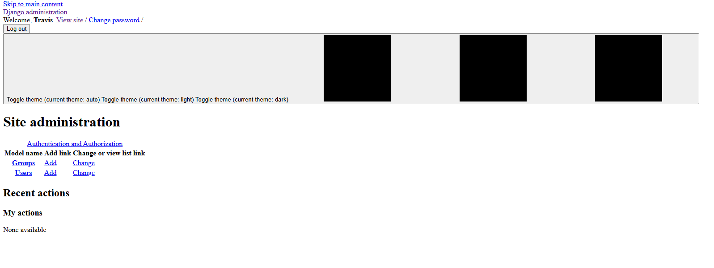

### Making New Databases

When you log into the backend, you shouldn't see any databases there yet. The first thing that needs to be done, is to create a data model in models.py, within the app. 

The first one I created was the product model.

Once it was fully coded, I ran migrations, then registered the new model in admin.py, which then sends the model to the django server.

To run migrations, simply: "python manage.py makemigrations"

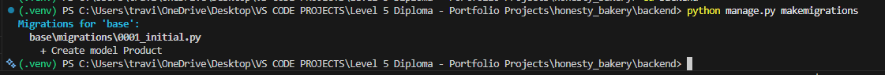

At this point, you have a chance to see if the migrations are correct before fully migrating. If so: "python manage.py migrate"

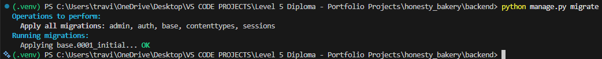

Here, you can see the first model created in the Django Admin: Products

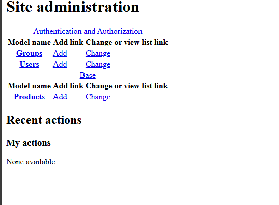

## Authentication

### JSON Web Tokens

(**INCOMPLETE SECTION**)

These are just encoded data about a user. **EXPLAIN MORE**

(**INCOMPLETE SECTION**)

## Tech. Used

1. HTML5
2. CSS3
3. ReactBoostrap, found (https://react-bootstrap.netlify.app/)[here].
5. React.js
6. JavaScript
7. Django
8. Django Rest Framework
9. LucidChart
10. Redux
11. PostgresSQL
12. AWS (Image storage)

## Credits

- Images: Sarah Howell
- Icons: FreeIcons
- Font Awesome icons
- React Documentation
- React-Bootstrap Documentation
- w3schools 
- Len Johnson (constant support and feedback)
- Google Fonts
- freeCodeCamp: Unit testing for React (https://www.freecodecamp.org/news/how-to-write-unit-tests-in-react/)
- Jest Library in Github: https://github.com/jestjs/jest/blob/main/website/versioned_docs/version-30.0/ExpectAPI.md

---

## Acknowledgements

I would like to thank my tutor, Len Johnson, for his guidance throughout the development of this project. His feedback helped shape both the technical implementation and the overall structure of the application. I would also like to acknowledge the Code Institute community for help which provided valuable learning resources during development.

---

